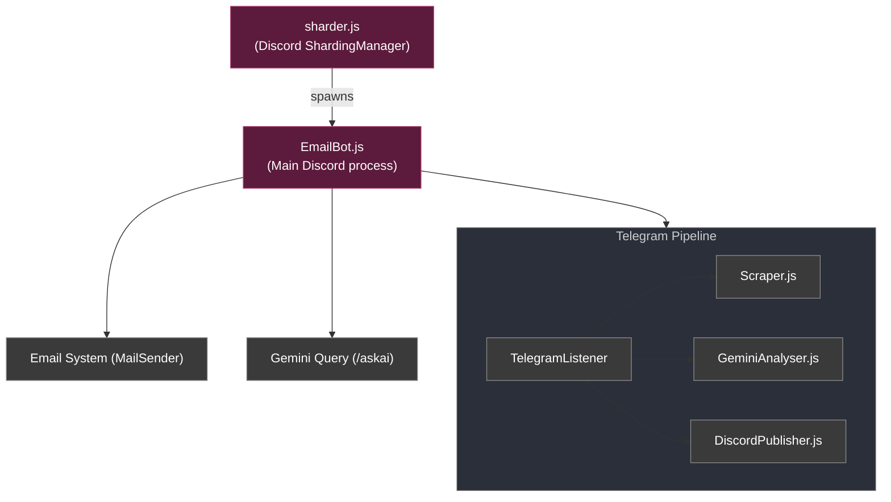

<!--
  UTM Johor Bahru Community — Octavia
-->

<br>
<p align="center">
  <a></a>
  <h3 align="center">Octavia</h3>
  <p align="center">
    Email verification and AI-powered event feed for the UTM Johor Bahru Community Discord.
  </p>

  <p align="center">
    
    
    
    
  </p>

  <p align="center">
    <a href="https://discord.gg/vuGTVyFgck">
      
    </a>
  </p>
</p>

---

## About

The official bot for the **UTMJBC** Discord server. It delivers three core features:

1. **Email Verification** - Students enter their official university email (`@graduate.utm.my`), receive a secure 6-digit OTP via nodemailer, and are automatically assigned Discord roles based on domain verification.
2. **Telegram Event Scraper** - It scrapes public UTM related Telegram channels and utilizes Gemini models via Google's `@google/genai` SDK to classify campus events. 
\
\
 Message's are passed through a multilayer filter to prevent duplication. Event details are extracted via structured JSON mapping, and then published in a Discord forum channel. If required, the posts are also translated from Malay to English.
3. **Grounded Assistant (`/askai`)** - An interactive Discord AI assistant that answers student queries strictly grounded in authoritative institutional sources (`utm.my` and `utm.gitbook.io`), with sources linked at the end of each message. (No AI slop responses...)

> [!NOTE]
> UTMJBC is an independent student-run community and is **not affiliated with or endorsed by Universiti Teknologi Malaysia (UTM)**.

---
## Documentation

Full documentation is available at the project docs site:

- [Commands Reference](docs/commands.md)
- [Self Hosting Guide](docs/self-hosting.md)
- [Architecture Overview](docs/architecture.md)
- [Developer API Reference](docs/api-reference.md)

---

## Self Hosting

### Docker (Recommended)

```bash
mkdir utmjbc-bot && cd utmjbc-bot
mkdir config data
```

Create `config/config.json`:

```json
{
  "token":    "<Discord Bot Token>",
  "clientId": "<Discord Bot Client ID>",
  "email":    "<Sender Email Address>",
  "username": "<SMTP Username>",
  "password": "<SMTP Password or App Password>",
  "smtpHost": "<SMTP Server, e.g. smtp.gmail.com>",
  "isGoogle": false
}
```

Create `docker-compose.yml`:

```yaml
version: '3'
services:
  utmjbc-bot:
    image: ghcr.io/mrc2rules/utmjbc-bot:latest
    environment:
      - GEMINI_API_KEY=your_gemini_key
    volumes:
      - ./config:/usr/app/config
      - ./data:/usr/app/data
    ports:
      - "8181:8181"
    restart: unless-stopped
```

```bash
docker compose up -d
```

### Manual Installation

**Requirements:** Node.js v18+

```bash
git clone https://github.com/mrc2rules/UTMJBC-Bot.git
cd UTMJBC-Bot
npm install
# fill in config/config.json (see above)
export GEMINI_API_KEY=your_key_here
npm start
```

### Configuration Reference

| Field | Description |
|-------|-------------|
| `token` | Discord Bot Token from the [Developer Portal](https://discord.com/developers/applications) |
| `clientId` | Discord Bot Client ID |
| `email` | Email address that sends verification codes |
| `username` | SMTP username (usually the same as `email`) |
| `password` | SMTP password or Gmail App Password |
| `smtpHost` | SMTP server (e.g. `smtp.gmail.com`) |
| `isGoogle` | `true` if using Gmail |
| `botDbPath` | Directory for persistent `bot.db` (recommended for hosted environments) |
| `telegramApiId` | From [my.telegram.org](https://my.telegram.org) — required for the event scraper |
| `telegramApiHash` | From [my.telegram.org](https://my.telegram.org) |
| `telegramPhone` | Phone number associated with the Telegram account |
| `telegramSession` | Save the session string here after first login (printed in logs) |
| `discordEventForumId` | Discord forum channel ID where events are posted |
| `GEMINI_API_KEY` | *(env var)* Google AI API key for Gemini features |

> [NOTE!] 
> **Gmail:** Create an [App Password](https://support.google.com/accounts/answer/185833) and set `isGoogle: true`.

### Debugging

Type `email` in the console to toggle verbose SMTP error logging.

---

## Contributors

### UTMJBC Development
- **mrc2rules** — [GitHub](https://github.com/mrc2rules)

### Original Project
Based on [EmailVerify](https://github.com/lkaesberg/EmailVerify) by [Lars Kaesberg](https://github.com/lkaesberg).

---

<p align="center">
  Made with ❤️ for the UTM Johor Bahru Community<br/><br/>
  <a href="https://discord.gg/vuGTVyFgck">
    
  </a>
  &nbsp;
  <a href="https://utm.gitbook.io/">
    
  </a>
  &nbsp;
  <a href="mailto:utmjbc@gmail.com">
    
  </a>
</p>
