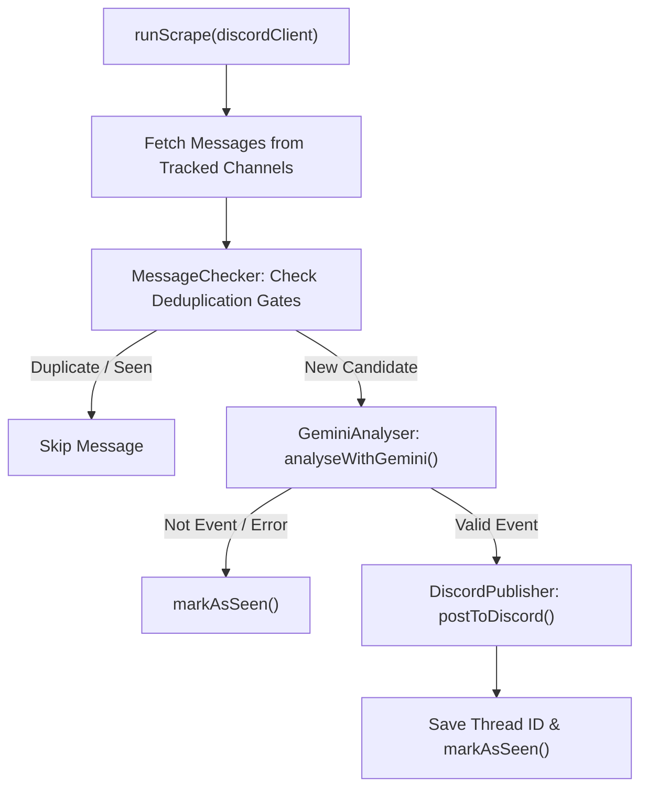

# Developer API Reference

Internal module APIs. Intended for contributors and developers extending the bot codebase.

---

## :simple-telegram: 1. Telegram Scraper & AI Engine { data-toc-label="1. Telegram Scraper & AI Engine" }

The Telegram scraper subsystem coordinates real-time event discovery, message deduplication, and structured AI event extraction.

---

### `src/telegram/MessageChecker.js`

Stateless utilities for message deduplication and language detection. All database functions return Promises.

---

#### `detectMalay(text)`

Returns `true` if `text` contains ≥ 4 unique Malay vocabulary keywords.

| Parameter | Type | Description |
|-----------|------|-------------|
| `text` | `string` | Raw message text. |

**Returns:** `boolean`

```js
const { detectMalay } = require('./MessageChecker');
detectMalay('Salam! Program ini adalah percuma untuk semua pelajar universiti kolej'); // → true
detectMalay('Join us for a hackathon!'); // → false
```

---

#### `hashMessageText(text)`

Normalises text (lowercase, collapse whitespace, strip punctuation) and returns its MD5 hex digest.

| Parameter | Type | Description |
|-----------|------|-------------|
| `text` | `string` | Raw message text. |

**Returns:** `string` — 32-character hex string.

Used as a fast exact-duplicate guard before the SimHash computation.

---

#### `simHashText(text)`

Computes a 64-bit SimHash fingerprint using FNV-1a token hashing.

| Parameter | Type | Description |
|-----------|------|-------------|
| `text` | `string` | Raw message text. |

**Returns:** `string` — 16-character hex string (64-bit fingerprint).

Two messages are considered near-duplicates if their Hamming distance is ≤ `SIMHASH_THRESHOLD`.

---

#### `normaliseTitleHash(title)`

Normalises a Gemini-extracted event title and returns its MD5 hex digest.

| Parameter | Type | Description |
|-----------|------|-------------|
| `title` | `string` | Event title from Gemini output. |

**Returns:** `string` — 32-character hex string.

Used for cross-channel same-event deduplication within a 14-day window.

---

#### `isEventPast(eventData)`

Returns `true` if the event's end (or start) date is strictly before today's local date.

| Parameter | Type | Description |
|-----------|------|-------------|
| `eventData` | `object` | Gemini event object. Must have `eventEndDate` or `startDate` in `YYYY-MM-DD` format. |

**Returns:** `boolean`

```js
isEventPast({ eventEndDate: '2024-01-01' }); // → true (past)
isEventPast({ eventEndDate: '2099-12-31' }); // → false
isEventPast({ eventEndDate: null });          // → false (no date, not skipped)
```

---

#### `isAlreadySeen(messageId, channelId)` → `Promise<boolean>`

Checks whether this message ID (from `channelId`) is already in the `seen_messages` table.

---

#### `isAlreadySeenByHash(hash)` → `Promise<boolean>`

Checks whether a message with this content MD5 has already been processed.

---

#### `isNearDuplicate(simhash, threshold?)` → `Promise<boolean>`

Loads the last 500 SimHash fingerprints from the DB and returns `true` if any has a Hamming distance ≤ `threshold` (default: `SIMHASH_THRESHOLD = 5`).

| Parameter | Type | Default | Description |
|-----------|------|---------|-------------|
| `simhash` | `string` | — | 16-char hex fingerprint from `simHashText()`. |
| `threshold` | `number` | `SIMHASH_THRESHOLD` | Override the bit-distance threshold. |

---

#### `isTitleDuplicate(titleHash)` → `Promise<boolean>`

Returns `true` if an event with this normalised title hash was posted in the last 14 days.

---

#### `markAsSeen(messageId, channelId, hash, simhash)` → `Promise<void>`

Inserts a row into `seen_messages`. Uses `INSERT OR IGNORE` so duplicate calls are safe.

| Parameter | Type | Description |
|-----------|------|-------------|
| `messageId` | `string\|number` | Telegram message ID. |
| `channelId` | `string` | Telegram channel ID. |
| `hash` | `string\|null` | Content MD5 hash (may be `null`). |
| `simhash` | `string\|null` | SimHash fingerprint (may be `null`). |

---

### `src/telegram/Scraper.js`

---

#### `runScrape(discordClient, options?)` → `Promise<object>`

Runs a full scrape cycle across all (or a specific) tracked Telegram channel(s).



| Parameter | Type | Default | Description |
|-----------|------|---------|-------------|
| `discordClient` | `Discord.Client` | — | The connected Discord.js client. |
| `options.force` | `boolean` | `false` | Skip dedup checks — re-processes all messages. Useful for debugging. |
| `options.targetChannelId` | `string` | `undefined` | Restrict the cycle to a single channel. |

**Returns:** `{ channelsScraped, totalEvents, totalGemini }` or `{ skipped: true }` if a scrape is already in progress.

```js
const { runScrape } = require('./Scraper');
const result = await runScrape(discordClient, { force: true, targetChannelId: '-100123456789' });
// → { channelsScraped: 1, totalEvents: 3, totalGemini: 7 }
```

---

#### `autoClosePastEvents(discordClient)` → `Promise<number>`

Locks and archives Discord forum threads for events whose `event_end_date` has passed. Also prunes `seen_messages` rows older than 30 days.

**Returns:** Count of threads closed.

---

### `src/telegram/GeminiAnalyser.js`

---

#### `analyseWithGemini(text)` → `Promise<object>`

Sends `text` to the Gemini 2.5 Flash REST API and returns structured event data.

| Parameter | Type | Description |
|-----------|------|-------------|
| `text` | `string` | Raw Telegram message text. |

**Returns:** One of:

```js
// Event detected:
{
  isEvent: true,
  type: 'Talk / Seminar / Workshop',   // one of 8 categories
  topic: 'Tech/Coding',                // one of 9 topic tags
  title: 'UTM Web Dev Workshop',
  date: '28 June 2026, 9:00 AM - 1:00 PM',
  startDate: '2026-06-28',             // ISO YYYY-MM-DD
  eventEndDate: '2026-06-28',
  startTime: '09:00',                  // 24-hour HH:MM
  endTime: '13:00',
  location: 'Computer Lab N28',
  exactText: '...',                    // full text (English-translated if Malay)
  merit: true,                         // UTM merit points mentioned
  cost: 'Free',                        // 'Free' | 'Paid - RM[X]' | 'Refundable Deposit - RM[X]' | 'Not specified'
  registrationUrl: 'bit.ly/example',
  sourceLanguage: 'English',
  _isMalay: false
}

// Not an event:
{ isEvent: false }

// API failure (caller should not mark as seen, to allow retry):
{ isEvent: false, _error: true }
```

**Event type values:** `'Club Activity'`, `'Club Recruitment'`, `'Club Announcement'`, `'Competition / Hackathon'`, `'Talk / Seminar / Workshop'`, `'Faculty / Department Event'`, `'University-wide Event'`, `'External / Collaboration Event'`

**Topic values:** `'Tech/Coding'`, `'Sports'`, `'Arts/Culture'`, `'Business/Career'`, `'Self-Dev'`, `'Community/Volunteer'`, `'Academic/Science'`, `'Other'`

> ⚠️ Requires `GEMINI_API_KEY` environment variable.

---

### `src/telegram/DiscordPublisher.js`

---

#### `postToDiscord(discordChannel, eventData, channelUsername, originalText, titleHash)` → `Promise<void>`

Builds a Discord embed from Gemini event data and creates a forum thread. Persists the thread to the `telegram_events` table.

| Parameter | Type | Description |
|-----------|------|-------------|
| `discordChannel` | `Discord.ForumChannel` | Target Discord forum channel. |
| `eventData` | `object` | Structured output from `analyseWithGemini()`. |
| `channelUsername` | `string` | Human-readable Telegram source channel name. |
| `originalText` | `string` | Raw message text (used as fallback if `exactText` is empty). |
| `titleHash` | `string` | Normalised title hash for cross-channel dedup storage. |

The function automatically:
- Picks a random embed colour from a curated palette.
- Applies Discord forum tags based on `topic`, `merit`, `cost`, and event type.
- Generates a Google Calendar deep-link button if the event has a start date.
- Adds a "Register Now" button if `registrationUrl` is present.
- Truncates descriptions exceeding Discord's 4096-character embed limit.

---

### `src/telegram/ChannelManager.js`

All functions return Promises.

| Function | Signature | Description |
|----------|-----------|-------------|
| `getChannels()` | `→ Promise<string[]>` | Returns all tracked channel IDs. |
| `getChannelDetails()` | `→ Promise<object[]>` | Returns full rows (`channel_id`, `channel_name`, `added_by`, `added_at`). |
| `channelExists(channelId)` | `→ Promise<boolean>` | True if the channel is tracked. |
| `addChannel(channelId, channelName, addedBy)` | `→ Promise<boolean>` | Insert channel. Returns `false` if already exists. |
| `updateChannelName(channelId, channelName)` | `→ Promise<boolean>` | Update display name. |
| `removeChannel(channelId)` | `→ Promise<boolean>` | Delete channel. Returns `false` if not found. |
| `clearSeenMessages()` | `→ Promise<number>` | Delete all rows from `seen_messages`. Returns rows deleted. |

---

### `src/telegram/KeywordBlacklistManager.js`

All functions return Promises.

| Function | Signature | Description |
|----------|-----------|-------------|
| `getKeywordBlacklist()` | `→ Promise<string[]>` | Returns all keywords in lowercase. |
| `addKeywordToBlacklist(keyword, addedBy)` | `→ Promise<boolean>` | Add keyword. Returns `false` if already exists. |
| `removeKeywordFromBlacklist(keyword)` | `→ Promise<boolean>` | Remove keyword. Returns `false` if not found. |
| `clearKeywordBlacklist()` | `→ Promise<number>` | Clear all keywords. Returns rows deleted. |

---

### `src/telegram/TelegramListener.js`

---

#### `start(discordClient)` → `Promise<void>`

Connects to the Telegram MTProto API. Prompts for a login code on first run if `telegramSession` is empty. Stores the authenticated client in `state.telegramClient`. Schedules the nightly auto-close cron.

---

#### `startScrapeCron(discordClient)` → `boolean`

Starts the periodic scrape cron at the configured interval. Returns `false` if the cron is already running.

---

#### `stopScrapeCron()` → `boolean`

Stops the periodic cron. Returns `false` if no cron is active.

---

#### `isScrapeCronActive()` → `boolean`

Returns `true` if the periodic cron is currently scheduled.

---

## :material-wrench: 2. Utilities & Localization { data-toc-label="2. Utilities & Localization" }

General-purpose helper modules handling string wildcards, error reporting, Discord embed builders, and multi-language support.

---

### `src/utils/wildcardMatch.js`

---

#### `emailMatchesDomains(email, domainPatterns)` → `boolean`

Returns `true` if `email` matches **any** pattern in `domainPatterns`. Matching is anchored to the end of the address (domain part).

```js
emailMatchesDomains('user@graduate.utm.my', ['@*.utm.my']); // → true
emailMatchesDomains('user@gmail.com',        ['@*.utm.my']); // → false
```

---

#### `emailIsBlacklisted(email, blacklistPatterns)` → `boolean`

Returns `true` if `email` matches any blacklist pattern. Patterns match anywhere in the address.

```js
emailIsBlacklisted('spam@tempmail.com', ['*@tempmail.*']); // → true
```

---

#### `getMatchingDomainPatterns(email, domainPatterns)` → `string[]`

Returns **all** patterns from `domainPatterns` that match `email`. Used for domain-specific role resolution (a user may match multiple patterns and receive roles for all of them).

---

#### `wildcardToRegex(pattern, options?)` → `RegExp`

Converts a wildcard string (using `*`) to a compiled `RegExp`.

| Option | Default | Description |
|--------|---------|-------------|
| `fullMatch` | `false` | Anchor the pattern to the full string. |
| `caseInsensitive` | `true` | Case-insensitive matching. |

---

### `src/utils/ErrorNotifier.js`

---

#### `ErrorNotifier.notify(options)` → `Promise<boolean>`

Sends an admin error notification to the guild's configured destination (owner DM, user DM, or channel). Falls back to the guild owner if the primary target fails.

| Option | Type | Required | Description |
|--------|------|----------|-------------|
| `guild` | `Discord.Guild` | ✅ | Guild where the error occurred. |
| `errorTitle` | `string` | ✅ | Short title shown in the embed. |
| `errorMessage` | `string` | ✅ | Detailed description for admins. |
| `user` | `Discord.User` | — | User who triggered the error (shown in embed). |
| `interaction` | `Discord.Interaction` | — | Interaction to reply to with a generic user-facing error. |
| `language` | `string` | — | Locale code for embedded strings (default `'english'`). |

**Returns:** `true` if the notification was sent successfully.

---

### `src/utils/embeds.js`

Factory functions that return `Discord.EmbedBuilder` instances.

| Function | Parameters | Description |
|----------|-----------|-------------|
| `createSessionExpiredEmbed(includeEmailStep?)` | `boolean` | Shown when the user's verification session has expired. |
| `createInvalidCodeEmbed(language)` | `string` | Shown when the entered OTP is wrong. |
| `createInvalidEmailEmbed(language)` | `string` | Shown when the email format or domain is invalid. |
| `createVerificationSuccessEmbed(language, roleNames, serverName, serverIconURL)` | `string, string[], string, string` | Shown on successful verification. |
| `createCodeSentEmbed(language, email)` | `string, string` | Shown after the OTP email is sent. |
| `createVerificationLogEmbed(options)` | `{ user, email, type, admin?, role? }` | Rich log embed sent to the log channel. |
| `createVerificationFailedLogEmbed(options)` | `{ user, email, reason }` | Failure embed for the log channel. |

---

### `src/Language.js`

---

#### `getLocale(language, key, ...vars)` → `string`

Retrieves a localised string, substituting each `%VAR%` placeholder with the corresponding argument in `vars`. Falls back to `'english'` if the key is missing in the requested language.

```js
const { getLocale } = require('./Language');
getLocale('english', 'mailTimeoutDescription', '30');
// → "You're sending emails too quickly.\n\nPlease wait **30 seconds** before..."
```

---

### `src/gemini/getGeminiResponse.js`

---

#### `getGeminiResponse(prompt)` → `Promise<string>`

Calls Gemini 2.5 Flash with Google Search grounding restricted to `utm.my` and `utm.gitbook.io`. Inline citations are injected into the response text. Used by the `/askai` command.

| Parameter | Type | Description |
|-----------|------|-------------|
| `prompt` | `string` | The user's question. |

**Returns:** Markdown-formatted response string. Returns an error message string on failure (does not throw).

> ⚠️ Requires `GEMINI_API_KEY` environment variable.

---

## :material-database: 3. Core Verification & Database Engine { data-toc-label="3. Core Verification & Database Engine" }

Singleton database interfaces and domain models powering the identity verification pipeline.

---

### `src/database/Database.js`

Singleton exported as `module.exports` (not a class constructor call from the consumer). All callback-based methods pass the result as the sole argument.

| Method | Signature | Description |
|--------|-----------|-------------|
| `getServerSettings(guildId, callback)` | `(string, fn(ServerSettings))` | Load guild config. Returns default `ServerSettings` if no row exists. |
| `updateServerSettings(guildId, serverSettings)` | `(string, ServerSettings)` | Upsert guild config. |
| `getEmailUser(email, guildId, callback)` | `(string, string, fn(EmailUser))` | Look up a verified email (MD5 hash). |
| `updateEmailUser(emailUser)` | `(EmailUser)` | Upsert a verification record. |
| `deleteUserData(userId)` | `(string)` | Remove a user's verification records across all guilds. |
| `deleteServerData(guildId)` | `(string)` | Delete all guild settings and user records for a guild. |
| `getGuildStats(guildId, callback)` | `(string, fn(stats))` | Get email/verification counts. Resets monthly counters if the month has changed. |
| `incrementMailsSent(guildId)` | `(string)` | Increment the total and monthly mail-sent counters. |
| `incrementVerifications(guildId)` | `(string)` | Increment the total and monthly verification counters. |
| `getAllGuildStats()` | `→ Promise<object[]>` | Return all rows from `guild_stats`. |

#### `ServerSettings` properties

| Property | Type | Default | Description |
|----------|------|---------|-------------|
| `domains` | `string[]` | `[]` | Allowed email domain patterns. |
| `blacklist` | `string[]` | `[]` | Blacklisted email patterns. |
| `defaultRoles` | `string[]` | `[]` | Role IDs always assigned on verify. |
| `domainRoles` | `object` | `{}` | Map of domain pattern → `string[]` of role IDs. |
| `verifiedRoleName` | `string` | `''` | Legacy single verified role ID. |
| `unverifiedRoleName` | `string` | `''` | Unverified role ID. |
| `language` | `string` | `'english'` | Bot locale. |
| `logChannel` | `string` | `''` | Channel ID for verification logs. |
| `autoVerify` | `boolean` | `false` | Auto-DM new members. |
| `autoAddUnverified` | `boolean` | `false` | Auto-assign unverified role on join. |
| `verifyMessage` | `string` | `''` | Custom text prepended to emails. |
| `errorNotifyType` | `string` | `'owner'` | `'owner'`, `'channel'`, or `'user'`. |
| `errorNotifyTarget` | `string` | `''` | Channel or user ID for error notifications. |
| `status` | `boolean` | computed | `true` if domains and defaultRoles are configured. |
