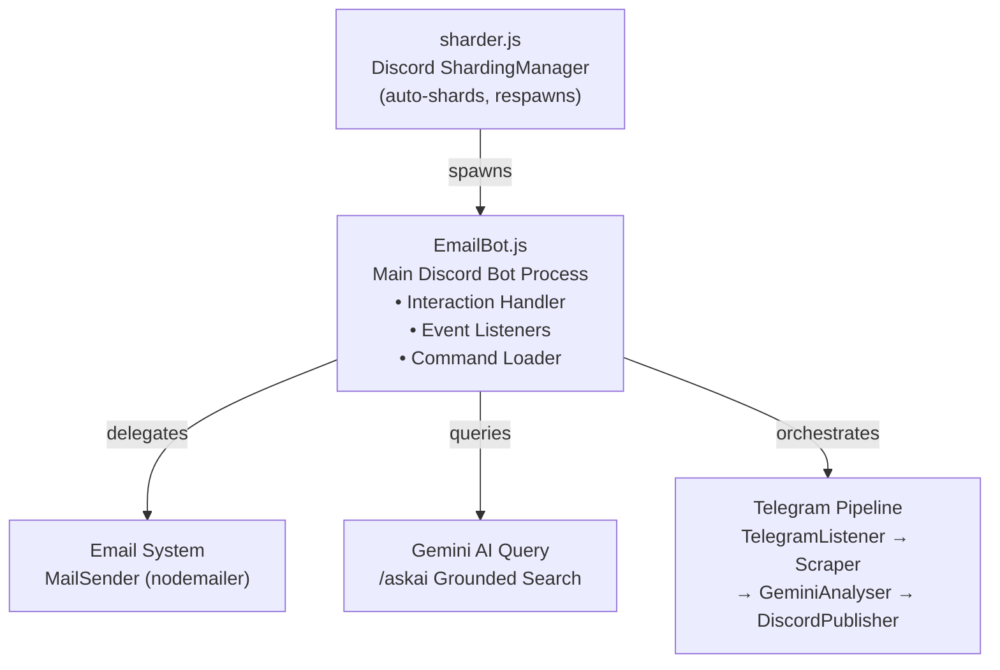
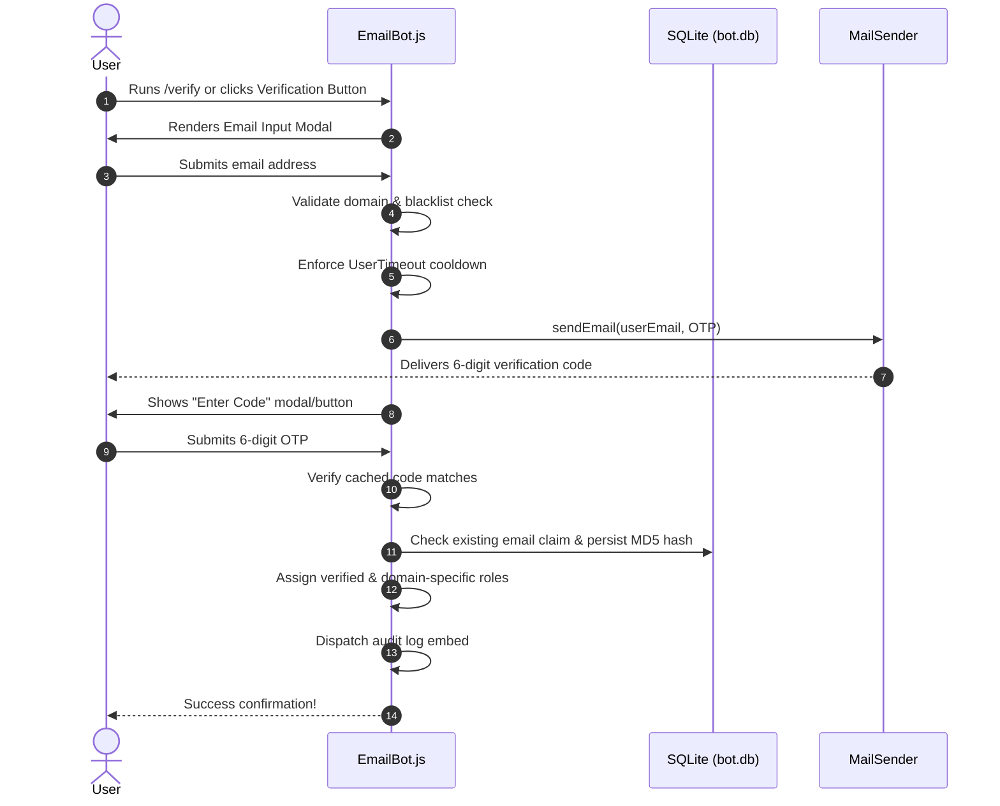
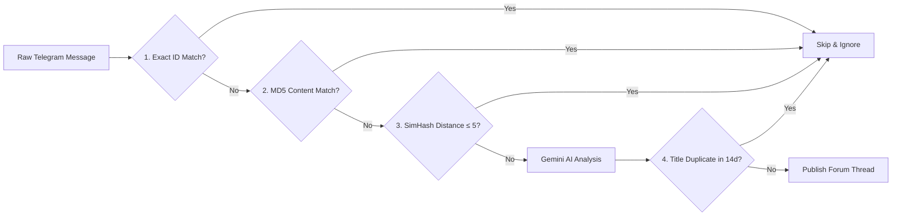

# System Architecture

UTMJBC Bot is designed as a modular, sharded Discord application combining an identity verification pipeline, an AI-driven event scraper, and an Express telemetry server.

---

## :material-sitemap: High-Level Process Topology

---

## :material-folder-table: Module Directory

| Module Path | Core Responsibility |
|-------------|---------------------|
| `src/sharder.js` | Process entry point. Spawns `EmailBot.js` child shards via `ShardingManager`. Runs automated Top.gg stat posting when configured. |
| `src/EmailBot.js` | Primary Discord event lifecycle manager. Registers slash commands, processes modals/buttons, and delegates subsystem calls. |
| `src/commands/` | Individual command definitions. Each file exports `{ data, execute, autocomplete? }`. |
| `src/mail/MailSender.js` | SMTP email dispatch client using `nodemailer`. Supports custom templates and OAuth2/App passwords. |
| `src/telegram/TelegramListener.js` | MTProto Telegram client using GramJS. Orchestrates background cron schedules (`startScrapeCron`). |
| `src/telegram/Scraper.js` | Core scraping engine. Iterates messages through deduplication gates, calls Gemini AI, and dispatches forum threads. |
| `src/telegram/GeminiAnalyser.js` | REST client wrapper around Google Gemini 2.5 Flash API for structured event extraction and translation. |
| `src/telegram/DiscordPublisher.js` | Formats embeds, creates forum threads, generates Google Calendar links, and tracks thread IDs. |
| `src/telegram/MessageChecker.js` | Cryptographic fingerprinting tools: MD5 content hashing, 64-bit SimHash near-duplicate detection, title window lookups. |
| `src/database/Database.js` | SQLite singleton managing `bot.db` (guild settings, email user records, verification metrics). |
| `src/shared/db.js` | SQLite singleton managing `telegram_events.db` (processed message IDs, deduplication tables). |
| `src/gemini/getGeminiResponse.js` | Grounded search handler for the `/askai` command. Restricts queries to university web domains. |
| `src/api/ServerStatsAPI.js` | Embedded Express HTTP server on port `8181` exposing `/stats/current` and `/stats/history` endpoints. |

---

## :material-database: Dual SQLite Database Isolation

To prevent thread contention and isolate domain responsibilities, the bot maintains two dedicated SQLite database files.

=== ":material-account-lock: Email Verification Database (`bot.db`)"

    | Table Name | Description |
    |------------|-------------|
    | `guilds` | Per-guild configuration (allowlists, blocklists, language settings, channel mappings). |
    | `userEmails` | Verified identity records storing **MD5-hashed** email addresses. |
    | `guild_stats` | Historical verification counts and mail dispatch tallies per guild. |

=== ":material-telegram: Telegram Scraper Database (`telegram_events.db`)"

    | Table Name | Description |
    |------------|-------------|
    | `seen_messages` | Deduplication fingerprints (Message ID, MD5 hash, 64-bit SimHash integer). |
    | `telegram_channels` | Tracked Telegram channels (`-100...` numeric IDs and usernames). |
    | `telegram_events` | Map of published Discord forum thread IDs for lifecycle auto-locking. |
    | `telegram_blacklist` | Keyword filter list for broadcast suppression. |

---

## :material-shield-check: Email Verification Lifecycle

---

## :material-filter: Telegram Scraper Deduplication Stack

The Telegram pipeline applies a strict 4-stage filter before invoking AI processing to conserve API tokens and prevent duplicate threads.

| Layer | Method | Window / Threshold |
|-------|--------|--------------------|
| **1. Exact Message ID** | String match on `channelId_messageId` | Per-channel lifetime |
| **2. MD5 Content Hash** | Hex digest of normalized text content | Cross-channel lifetime |
| **3. SimHash Distance** | 64-bit locality-sensitive FNV-1a fingerprint | Cross-channel (Hamming distance $\le 5$ bits) |
| **4. Title Window** | Normalized Gemini title comparison | Cross-channel within 14-day window |
