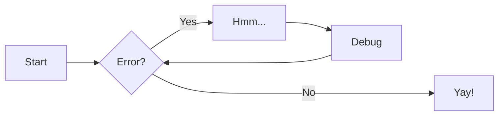
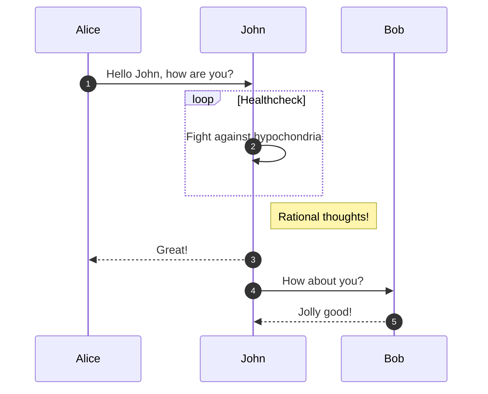
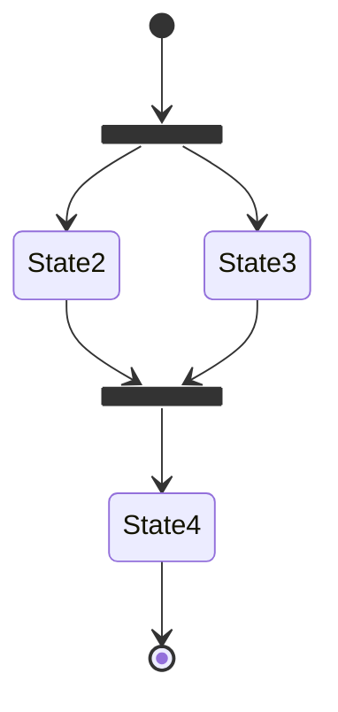
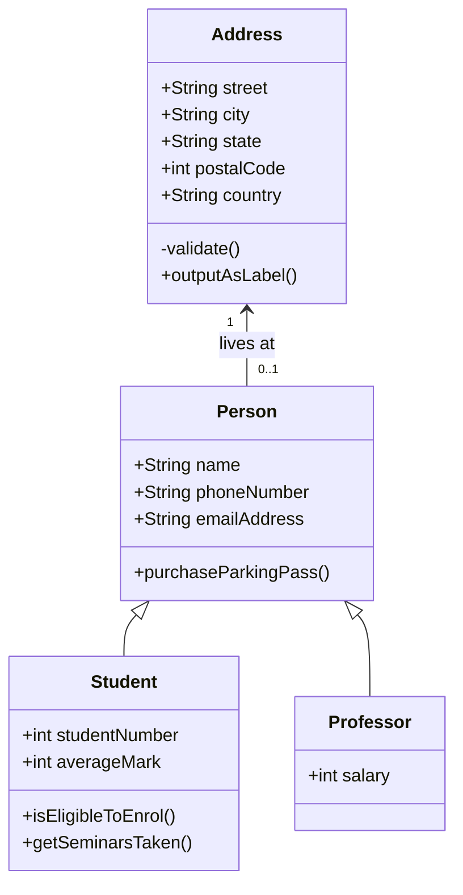
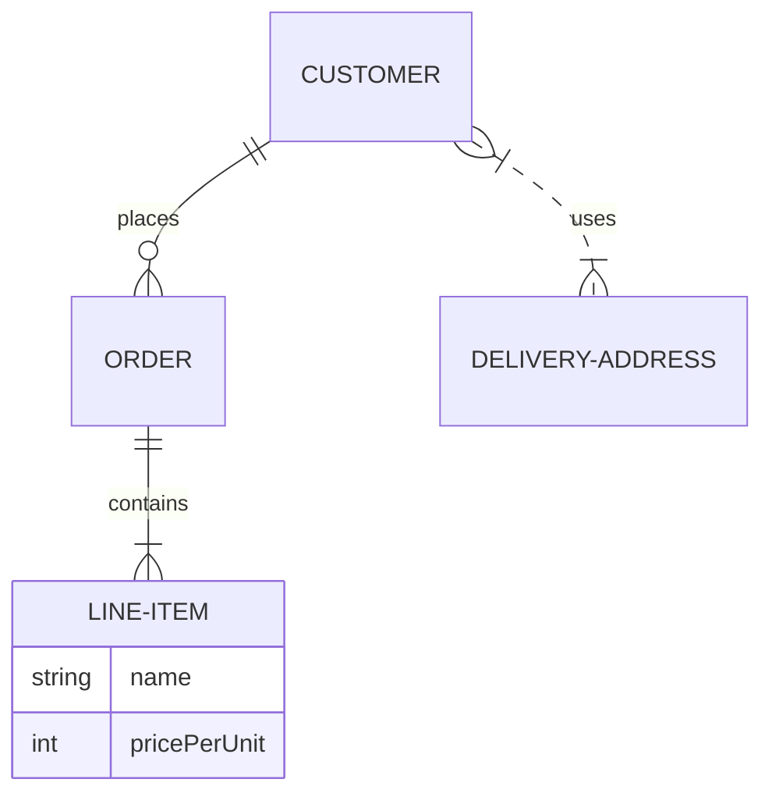

# Material for MkDocs — Reference (aggregated)

Source: https://squidfunk.github.io/mkdocs-material/reference/


---

<!-- SOURCE: docs/reference/index.md -->

# Reference

Material for MkDocs is packed with many great features that make technical
writing a joyful activity. This section of the documentation explains how to set up
a page, and showcases all available specimen that can be used directly from
within Markdown files.

## Configuration

## Usage

### Setting the page `title`

Each page has a designated title, which is used in the navigation sidebar, for
[social cards] and in other places. While MkDocs attempts to automatically
determine the title of a page in a [four step process], the title can also be
explicitly set with the front matter `title` property:

``` yaml
---
title: Lorem ipsum dolor sit amet # (1)!
---

# Page title
...
```

1.  This line sets the [`title`][title] inside the HTML document's
    [`head`][head] for the generated page to the given value. Note that the
    site title, which is set via [`site_name`][site_name], is appended with a
    dash.

  [social cards]: ../setup/setting-up-social-cards.md
  [four step process]: https://www.mkdocs.org/user-guide/writing-your-docs/#meta-data
  [title]: https://developer.mozilla.org/en-US/docs/Web/HTML/Element/title
  [head]: https://developer.mozilla.org/en-US/docs/Web/HTML/Element/head
  [site_name]: https://www.mkdocs.org/user-guide/configuration/#site_name

### Setting the page `description`

A Markdown file can include a description that is added to the `meta` tags of
a page, and is also used for [social cards]. It's a good idea to set a
[`site_description`][site_description] in `mkdocs.yml` as a fallback value if
the author does not explicitly define a description for a Markdown file:

``` yaml
---
description: Nullam urna elit, malesuada eget finibus ut, ac tortor. # (1)!
---

# Page title
...
```

1.  This line sets the `meta` tag containing the description inside the
    document `head` for the current page to the provided value.

  [site_description]: https://www.mkdocs.org/user-guide/configuration/#site_description

### Setting the page `icon`

<!-- md:version 9.2.0 -->
<!-- md:flag experimental -->

An icon can be assigned to each page, which is then rendered as part of the
navigation sidebar, as well as [navigation tabs], if enabled. Use the front
matter `icon` property to reference an icon, adding the following lines at the
top of a Markdown file:

``` yaml
---
icon: material/emoticon-happy # (1)!
---

# Page title
...
```

1.  Enter a few keywords to find the perfect icon using our [icon search] and
    click on the shortcode to copy it to your clipboard:

    <div class="mdx-iconsearch" data-mdx-component="iconsearch">
      <input class="md-input md-input--stretch mdx-iconsearch__input" placeholder="Search icon" data-mdx-component="iconsearch-query" value="emoticon happy" />
      <div class="mdx-iconsearch-result" data-mdx-component="iconsearch-result" data-mdx-mode="file">
        <div class="mdx-iconsearch-result__meta"></div>
        <ol class="mdx-iconsearch-result__list"></ol>
      </div>
    </div>

  [icon search]: icons-emojis.md#search
  [navigation tabs]: ../setup/setting-up-navigation.md#navigation-tabs

### Setting the page `status`

<!-- md:version 9.2.0 -->
<!-- md:flag experimental -->
<!-- md:example page-status -->

A status can be assigned to each page, which is then displayed as part of the
navigation sidebar. First, associate a status identifier with a description by
adding the following to `mkdocs.yml`:

``` yaml
extra:
  status:
    <identifier>: <description> # (1)!
```

1.  The identifier can only include alphanumeric characters, as well as dashes
    and underscores. For example, if you have a status `Recently added`, you can
    set `new` as an identifier:

    ``` yaml
    extra:
      status:
        new: Recently added
    ```

The page status can now be set with the front matter `status` property. For
example, you can mark a page as `new` with the following lines at the top of a
Markdown file:

``` yaml
---
status: new
---

# Page title
...
```

The following status identifiers are already defined:

- :material-alert-decagram: – `new`
- :material-trash-can: – `deprecated`

You can define a custom page status this way but if you want it to
have an icon other than the default one you need to also configure
that in your `extra.css`. We have an [example for a custom
page status] to get you started.

[example for a custom page status]: https://mkdocs-material.github.io/examples/page-status/

### Setting the page `subtitle`

<!-- md:version 9.6.0 -->
<!-- md:flag experimental -->

Each page can define a subtitle, which is then rendered below the title as part
of the navigation sidebar by using the front matter `subtitle` property, and
adding the following lines:

``` yaml
---
subtitle: Nullam urna elit, malesuada eget finibus ut, ac tortor
---

# Page title
...
```

### Setting the page `template`

If you're using [theme extension] and created a new page template in the
`overrides` directory, you can enable it for a specific page. Add the following
lines at the top of a Markdown file:

``` yaml
---
template: custom.html
---

# Page title
...
```

??? question "How to set a page template for an entire folder?"

    With the help of the [built-in meta plugin], you can set a custom template
    for an entire section and all nested pages, by creating a `.meta.yml` file
    in the corresponding folder with the following content:

    ``` yaml
    template: custom.html
    ```

  [theme extension]: ../customization.md#extending-the-theme
  [built-in meta plugin]: ../plugins/meta.md

## Customization

### Using metadata in templates

#### :material-check-all: on all pages

In order to add custom `meta` tags to your document, you can [extend the theme
][theme extension] and [override the `extrahead` block][overriding blocks],
e.g. to add indexing policies for search engines via the `robots` property:

``` html



  <meta name="robots" content="noindex, nofollow" />

```

  [overriding blocks]: ../customization.md#overriding-blocks

#### :material-check: on a single page

If you want to set a `meta` tag on a single page, or want to set different
values for different pages, you can use the `page.meta` object inside your
template override, e.g.:

``` html



  
    <meta name="robots" content="{{ page.meta.robots }}" />
  
    <meta name="robots" content="index, follow" />
  

```

You can now use `robots` exactly like [`title`][title] and
[`description`][description] to set values. Note that in this case, the
template defines an `else` branch, which would set a default if none was given.

  [title]: #setting-the-page-title
  [description]: #setting-the-page-description


---

<!-- SOURCE: docs/reference/admonitions.md -->

---
icon: material/alert-outline
---

# Admonitions

Admonitions, also known as _call-outs_, are an excellent choice for including
side content without significantly interrupting the document flow. Material for
MkDocs provides several different types of admonitions and allows for the
inclusion and nesting of arbitrary content.

## Configuration

This configuration enables admonitions, allows to make them collapsible and to
nest arbitrary content inside admonitions. Add the following lines to
`mkdocs.yml`:

``` yaml
markdown_extensions:
  - admonition
  - pymdownx.details
  - pymdownx.superfences
```

See additional configuration options:

- [Admonition]
- [Details]
- [SuperFences]

  [Admonition]: ../setup/extensions/python-markdown.md#admonition
  [Details]: ../setup/extensions/python-markdown-extensions.md#details
  [SuperFences]: ../setup/extensions/python-markdown-extensions.md#superfences

### Admonition icons

<!-- md:version 8.3.0 -->

Each of the supported admonition types has a distinct icon, which can be changed
to any icon bundled with the theme, or even a [custom icon]. Add the following
lines to `mkdocs.yml`:

``` yaml
theme:
  icon:
    admonition:
      <type>: <icon> # (1)!
```

1.  Enter a few keywords to find the perfect icon using our [icon search] and
    click on the shortcode to copy it to your clipboard:

    <div class="mdx-iconsearch" data-mdx-component="iconsearch">
      <input class="md-input md-input--stretch mdx-iconsearch__input" placeholder="Search icon" data-mdx-component="iconsearch-query" value="alert" />
      <div class="mdx-iconsearch-result" data-mdx-component="iconsearch-result" data-mdx-mode="file">
        <div class="mdx-iconsearch-result__meta"></div>
        <ol class="mdx-iconsearch-result__list"></ol>
      </div>
    </div>

??? example "Expand to show alternate icon sets"

    === ":octicons-mark-github-16: Octicons"

        ``` yaml
        theme:
          icon:
            admonition:
              note: octicons/tag-16
              abstract: octicons/checklist-16
              info: octicons/info-16
              tip: octicons/squirrel-16
              success: octicons/check-16
              question: octicons/question-16
              warning: octicons/alert-16
              failure: octicons/x-circle-16
              danger: octicons/zap-16
              bug: octicons/bug-16
              example: octicons/beaker-16
              quote: octicons/quote-16
        ```


    === ":fontawesome-brands-font-awesome: FontAwesome"

        ``` yaml
        theme:
          icon:
            admonition:
              note: fontawesome/solid/note-sticky
              abstract: fontawesome/solid/book
              info: fontawesome/solid/circle-info
              tip: fontawesome/solid/bullhorn
              success: fontawesome/solid/check
              question: fontawesome/solid/circle-question
              warning: fontawesome/solid/triangle-exclamation
              failure: fontawesome/solid/bomb
              danger: fontawesome/solid/skull
              bug: fontawesome/solid/robot
              example: fontawesome/solid/flask
              quote: fontawesome/solid/quote-left
        ```

  [custom icon]: ../setup/changing-the-logo-and-icons.md#additional-icons
  [supported types]: #supported-types
  [icon search]: icons-emojis.md#search

## Usage

Admonitions follow a simple syntax: a block starts with `!!!`, followed by a
single keyword used as a [type qualifier]. The content of the block follows on
the next line, indented by four spaces:

``` markdown title="Admonition"
!!! note

    Lorem ipsum dolor sit amet, consectetur adipiscing elit. Nulla et euismod
    nulla. Curabitur feugiat, tortor non consequat finibus, justo purus auctor
    massa, nec semper lorem quam in massa.
```

<div class="result" markdown>

!!! note

    Lorem ipsum dolor sit amet, consectetur adipiscing elit. Nulla et euismod
    nulla. Curabitur feugiat, tortor non consequat finibus, justo purus auctor
    massa, nec semper lorem quam in massa.

</div>

  [type qualifier]: #supported-types

### Changing the title

By default, the title will equal the type qualifier in titlecase. However, it
can be changed by adding a quoted string containing valid Markdown (including
links, formatting, ...) after the type qualifier:

``` markdown title="Admonition with custom title"
!!! note "Phasellus posuere in sem ut cursus"

    Lorem ipsum dolor sit amet, consectetur adipiscing elit. Nulla et euismod
    nulla. Curabitur feugiat, tortor non consequat finibus, justo purus auctor
    massa, nec semper lorem quam in massa.
```

<div class="result" markdown>

!!! note "Phasellus posuere in sem ut cursus"

    Lorem ipsum dolor sit amet, consectetur adipiscing elit. Nulla et euismod
    nulla. Curabitur feugiat, tortor non consequat finibus, justo purus auctor
    massa, nec semper lorem quam in massa.

</div>

### Nested admonitions

You can also include nested admonitions in your documentation. To do this, you
can use your existing admonitions and indent the desired ones:

``` markdown title="Nested Admonition"
!!! note "Outer Note"

    Lorem ipsum dolor sit amet, consectetur adipiscing elit. Nulla et euismod
    nulla. Curabitur feugiat, tortor non consequat finibus, justo purus auctor
    massa, nec semper lorem quam in massa.
    
    !!! note "Inner Note"

        Lorem ipsum dolor sit amet, consectetur adipiscing elit. Nulla et euismod
        nulla. Curabitur feugiat, tortor non consequat finibus, justo purus auctor
        massa, nec semper lorem quam in massa.
```

<div class="result" markdown>

!!! note "Outer Note"

    Lorem ipsum dolor sit amet, consectetur adipiscing elit. Nulla et euismod
    nulla. Curabitur feugiat, tortor non consequat finibus, justo purus auctor
    massa, nec semper lorem quam in massa.
    
    !!! note "Inner Note"

        Lorem ipsum dolor sit amet, consectetur adipiscing elit. Nulla et euismod
        nulla. Curabitur feugiat, tortor non consequat finibus, justo purus auctor
        massa, nec semper lorem quam in massa.
</div>

### Removing the title

Similar to [changing the title], the icon and title can be omitted entirely by
adding an empty string directly after the type qualifier. Note that this will
not work for [collapsible blocks]:

``` markdown title="Admonition without title"
!!! note ""

    Lorem ipsum dolor sit amet, consectetur adipiscing elit. Nulla et euismod
    nulla. Curabitur feugiat, tortor non consequat finibus, justo purus auctor
    massa, nec semper lorem quam in massa.
```

<div class="result" markdown>

!!! note ""

    Lorem ipsum dolor sit amet, consectetur adipiscing elit. Nulla et euismod
    nulla. Curabitur feugiat, tortor non consequat finibus, justo purus auctor
    massa, nec semper lorem quam in massa.

</div>

  [changing the title]: #changing-the-title
  [collapsible blocks]: #collapsible-blocks

### Collapsible blocks

When [Details] is enabled and an admonition block is started with `???` instead
of `!!!`, the admonition is rendered as an expandable block with a small toggle
on the right side:

``` markdown title="Admonition, collapsible"
??? note

    Lorem ipsum dolor sit amet, consectetur adipiscing elit. Nulla et euismod
    nulla. Curabitur feugiat, tortor non consequat finibus, justo purus auctor
    massa, nec semper lorem quam in massa.
```

<div class="result" markdown>

??? note

    Lorem ipsum dolor sit amet, consectetur adipiscing elit. Nulla et euismod
    nulla. Curabitur feugiat, tortor non consequat finibus, justo purus auctor
    massa, nec semper lorem quam in massa.

</div>

Adding a `+` after the `???` token renders the block expanded:

``` markdown title="Admonition, collapsible and initially expanded"
???+ note

    Lorem ipsum dolor sit amet, consectetur adipiscing elit. Nulla et euismod
    nulla. Curabitur feugiat, tortor non consequat finibus, justo purus auctor
    massa, nec semper lorem quam in massa.
```

<div class="result" markdown>

???+ note

    Lorem ipsum dolor sit amet, consectetur adipiscing elit. Nulla et euismod
    nulla. Curabitur feugiat, tortor non consequat finibus, justo purus auctor
    massa, nec semper lorem quam in massa.

</div>

### Inline blocks

Admonitions can also be rendered as inline blocks (e.g., for sidebars), placing
them to the right using the `inline` + `end` modifiers, or to the left using
only the `inline` modifier:

=== ":octicons-arrow-right-16: inline end"

    !!! info inline end "Lorem ipsum"

        Lorem ipsum dolor sit amet, consectetur adipiscing elit. Nulla et
        euismod nulla. Curabitur feugiat, tortor non consequat finibus, justo
        purus auctor massa, nec semper lorem quam in massa.

    ``` markdown
    !!! info inline end "Lorem ipsum"

        Lorem ipsum dolor sit amet, consectetur
        adipiscing elit. Nulla et euismod nulla.
        Curabitur feugiat, tortor non consequat
        finibus, justo purus auctor massa, nec
        semper lorem quam in massa.
    ```

    Use `inline end` to align to the right (left for rtl languages).

=== ":octicons-arrow-left-16: inline"

    !!! info inline "Lorem ipsum"

        Lorem ipsum dolor sit amet, consectetur adipiscing elit. Nulla et
        euismod nulla. Curabitur feugiat, tortor non consequat finibus, justo
        purus auctor massa, nec semper lorem quam in massa.

    ``` markdown
    !!! info inline "Lorem ipsum"

        Lorem ipsum dolor sit amet, consectetur
        adipiscing elit. Nulla et euismod nulla.
        Curabitur feugiat, tortor non consequat
        finibus, justo purus auctor massa, nec
        semper lorem quam in massa.
    ```

    Use `inline` to align to the left (right for rtl languages).

__Important__: admonitions that use the `inline` modifiers _must_ be declared
prior to the content block you want to place them beside. If there's
insufficient space to render the admonition next to the block, the admonition
will stretch to the full width of the viewport, e.g., on mobile viewports.

### Supported types

Following is a list of type qualifiers provided by Material for MkDocs, whereas
the default type, and thus fallback for unknown type qualifiers, is `note`[^1]:

  [^1]:
    Previously, some of the supported types defined more than one qualifier.
    For example, authors could use `summary` or `tldr` as alternative qualifiers
    to render an [`abstract`](#+type:abstract) admonition. As this increased the
    size of the CSS that is shipped with Material for MkDocs, the additional
    type qualifiers are now all deprecated and will be removed in the next major
    version. This will also be mentioned in the upgrade guide.

<!-- md:option type:note -->

:   !!! note

        Lorem ipsum dolor sit amet, consectetur adipiscing elit. Nulla et
        euismod nulla. Curabitur feugiat, tortor non consequat finibus, justo
        purus auctor massa, nec semper lorem quam in massa.

<!-- md:option type:abstract -->

:   !!! abstract

        Lorem ipsum dolor sit amet, consectetur adipiscing elit. Nulla et
        euismod nulla. Curabitur feugiat, tortor non consequat finibus, justo
        purus auctor massa, nec semper lorem quam in massa.

<!-- md:option type:info -->

:   !!! info

        Lorem ipsum dolor sit amet, consectetur adipiscing elit. Nulla et
        euismod nulla. Curabitur feugiat, tortor non consequat finibus, justo
        purus auctor massa, nec semper lorem quam in massa.

<!-- md:option type:tip -->

:   !!! tip

        Lorem ipsum dolor sit amet, consectetur adipiscing elit. Nulla et
        euismod nulla. Curabitur feugiat, tortor non consequat finibus, justo
        purus auctor massa, nec semper lorem quam in massa.

<!-- md:option type:success -->

:   !!! success

        Lorem ipsum dolor sit amet, consectetur adipiscing elit. Nulla et
        euismod nulla. Curabitur feugiat, tortor non consequat finibus, justo
        purus auctor massa, nec semper lorem quam in massa.

<!-- md:option type:question -->

:   !!! question

        Lorem ipsum dolor sit amet, consectetur adipiscing elit. Nulla et
        euismod nulla. Curabitur feugiat, tortor non consequat finibus, justo
        purus auctor massa, nec semper lorem quam in massa.

<!-- md:option type:warning -->

:   !!! warning

        Lorem ipsum dolor sit amet, consectetur adipiscing elit. Nulla et
        euismod nulla. Curabitur feugiat, tortor non consequat finibus, justo
        purus auctor massa, nec semper lorem quam in massa.

<!-- md:option type:failure -->

:   !!! failure

        Lorem ipsum dolor sit amet, consectetur adipiscing elit. Nulla et
        euismod nulla. Curabitur feugiat, tortor non consequat finibus, justo
        purus auctor massa, nec semper lorem quam in massa.

<!-- md:option type:danger -->

:   !!! danger

        Lorem ipsum dolor sit amet, consectetur adipiscing elit. Nulla et
        euismod nulla. Curabitur feugiat, tortor non consequat finibus, justo
        purus auctor massa, nec semper lorem quam in massa.

<!-- md:option type:bug -->

:   !!! bug

        Lorem ipsum dolor sit amet, consectetur adipiscing elit. Nulla et
        euismod nulla. Curabitur feugiat, tortor non consequat finibus, justo
        purus auctor massa, nec semper lorem quam in massa.

<!-- md:option type:example -->

:   !!! example

        Lorem ipsum dolor sit amet, consectetur adipiscing elit. Nulla et
        euismod nulla. Curabitur feugiat, tortor non consequat finibus, justo
        purus auctor massa, nec semper lorem quam in massa.

<!-- md:option type:quote -->

:   !!! quote

        Lorem ipsum dolor sit amet, consectetur adipiscing elit. Nulla et
        euismod nulla. Curabitur feugiat, tortor non consequat finibus, justo
        purus auctor massa, nec semper lorem quam in massa.

## Customization

### Classic admonitions

Prior to version <!-- md:version 8.5.6 -->, admonitions had a slightly
different appearance:

!!! classic "Note"

    Lorem ipsum dolor sit amet, consectetur adipiscing elit. Nulla et euismod
    nulla. Curabitur feugiat, tortor non consequat finibus, justo purus auctor
    massa, nec semper lorem quam in massa.

If you want to restore this appearance, add the following CSS to an
[additional style sheet]:

<style>
  .md-typeset .admonition.classic {
    border-width: 0;
    border-left-width: 4px;
  }
</style>

=== ":octicons-file-code-16: `docs/stylesheets/extra.css`"

    ``` css
    .md-typeset .admonition,
    .md-typeset details {
      border-width: 0;
      border-left-width: 4px;
    }
    ```

=== ":octicons-file-code-16: `mkdocs.yml`"

    ``` yaml
    extra_css:
      - stylesheets/extra.css
    ```

### Custom admonitions

If you want to add a custom admonition type, all you need is a color and an
`*.svg` icon. Copy the icon's code from the [`.icons`][custom icons] folder
and add the following CSS to an [additional style sheet]:

<style>
  :root {
    --md-admonition-icon--pied-piper: url('data:image/svg+xml;charset=utf-8,<svg xmlns="http://www.w3.org/2000/svg" viewBox="0 0 576 512"><path d="M244 246c-3.2-2-6.3-2.9-10.1-2.9-6.6 0-12.6 3.2-19.3 3.7l1.7 4.9zm135.9 197.9c-19 0-64.1 9.5-79.9 19.8l6.9 45.1c35.7 6.1 70.1 3.6 106-9.8-4.8-10-23.5-55.1-33-55.1zM340.8 177c6.6 2.8 11.5 9.2 22.7 22.1 2-1.4 7.5-5.2 7.5-8.6 0-4.9-11.8-13.2-13.2-23 11.2-5.7 25.2-6 37.6-8.9 68.1-16.4 116.3-52.9 146.8-116.7C548.3 29.3 554 16.1 554.6 2l-2 2.6c-28.4 50-33 63.2-81.3 100-31.9 24.4-69.2 40.2-106.6 54.6l-6.3-.3v-21.8c-19.6 1.6-19.7-14.6-31.6-23-18.7 20.6-31.6 40.8-58.9 51.1-12.7 4.8-19.6 10-25.9 21.8 34.9-16.4 91.2-13.5 98.8-10zM555.5 0l-.6 1.1-.3.9.6-.6zm-59.2 382.1c-33.9-56.9-75.3-118.4-150-115.5l-.3-6c-1.1-13.5 32.8 3.2 35.1-31l-14.4 7.2c-19.8-45.7-8.6-54.3-65.5-54.3-14.7 0-26.7 1.7-41.4 4.6 2.9 18.6 2.2 36.7-10.9 50.3l19.5 5.5c-1.7 3.2-2.9 6.3-2.9 9.8 0 21 42.8 2.9 42.8 33.6 0 18.4-36.8 60.1-54.9 60.1-8 0-53.7-50-53.4-60.1l.3-4.6 52.3-11.5c13-2.6 12.3-22.7-2.9-22.7-3.7 0-43.1 9.2-49.4 10.6-2-5.2-7.5-14.1-13.8-14.1-3.2 0-6.3 3.2-9.5 4-9.2 2.6-31 2.9-21.5 20.1L15.9 298.5c-5.5 1.1-8.9 6.3-8.9 11.8 0 6 5.5 10.9 11.5 10.9 8 0 131.3-28.4 147.4-32.2 2.6 3.2 4.6 6.3 7.8 8.6 20.1 14.4 59.8 85.9 76.4 85.9 24.1 0 58-22.4 71.3-41.9 3.2-4.3 6.9-7.5 12.4-6.9.6 13.8-31.6 34.2-33 43.7-1.4 10.2-1 35.2-.3 41.1 26.7 8.1 52-3.6 77.9-2.9 4.3-21 10.6-41.9 9.8-63.5l-.3-9.5c-1.4-34.2-10.9-38.5-34.8-58.6-1.1-1.1-2.6-2.6-3.7-4 2.2-1.4 1.1-1 4.6-1.7 88.5 0 56.3 183.6 111.5 229.9 33.1-15 72.5-27.9 103.5-47.2-29-25.6-52.6-45.7-72.7-79.9zm-196.2 46.1v27.2l11.8-3.4-2.9-23.8zm-68.7-150.4l24.1 61.2 21-13.8-31.3-50.9zm84.4 154.9l2 12.4c9-1.5 58.4-6.6 58.4-14.1 0-1.4-.6-3.2-.9-4.6-26.8 0-36.9 3.8-59.5 6.3z"/></svg>')
  }
  .md-typeset .admonition.pied-piper,
  .md-typeset details.pied-piper {
    border-color: rgb(43, 155, 70);
  }
  .md-typeset .pied-piper > .admonition-title,
  .md-typeset .pied-piper > summary {
    background-color: rgba(43, 155, 70, 0.1);
  }
  .md-typeset .pied-piper > .admonition-title::before,
  .md-typeset .pied-piper > summary::before {
    background-color: rgb(43, 155, 70);
    -webkit-mask-image: var(--md-admonition-icon--pied-piper);
            mask-image: var(--md-admonition-icon--pied-piper);
  }
</style>

=== ":octicons-file-code-16: `docs/stylesheets/extra.css`"

    ``` css
    :root {
      --md-admonition-icon--pied-piper: url('data:image/svg+xml;charset=utf-8,<svg xmlns="http://www.w3.org/2000/svg" viewBox="0 0 576 512"><path d="M244 246c-3.2-2-6.3-2.9-10.1-2.9-6.6 0-12.6 3.2-19.3 3.7l1.7 4.9zm135.9 197.9c-19 0-64.1 9.5-79.9 19.8l6.9 45.1c35.7 6.1 70.1 3.6 106-9.8-4.8-10-23.5-55.1-33-55.1zM340.8 177c6.6 2.8 11.5 9.2 22.7 22.1 2-1.4 7.5-5.2 7.5-8.6 0-4.9-11.8-13.2-13.2-23 11.2-5.7 25.2-6 37.6-8.9 68.1-16.4 116.3-52.9 146.8-116.7C548.3 29.3 554 16.1 554.6 2l-2 2.6c-28.4 50-33 63.2-81.3 100-31.9 24.4-69.2 40.2-106.6 54.6l-6.3-.3v-21.8c-19.6 1.6-19.7-14.6-31.6-23-18.7 20.6-31.6 40.8-58.9 51.1-12.7 4.8-19.6 10-25.9 21.8 34.9-16.4 91.2-13.5 98.8-10zM555.5 0l-.6 1.1-.3.9.6-.6zm-59.2 382.1c-33.9-56.9-75.3-118.4-150-115.5l-.3-6c-1.1-13.5 32.8 3.2 35.1-31l-14.4 7.2c-19.8-45.7-8.6-54.3-65.5-54.3-14.7 0-26.7 1.7-41.4 4.6 2.9 18.6 2.2 36.7-10.9 50.3l19.5 5.5c-1.7 3.2-2.9 6.3-2.9 9.8 0 21 42.8 2.9 42.8 33.6 0 18.4-36.8 60.1-54.9 60.1-8 0-53.7-50-53.4-60.1l.3-4.6 52.3-11.5c13-2.6 12.3-22.7-2.9-22.7-3.7 0-43.1 9.2-49.4 10.6-2-5.2-7.5-14.1-13.8-14.1-3.2 0-6.3 3.2-9.5 4-9.2 2.6-31 2.9-21.5 20.1L15.9 298.5c-5.5 1.1-8.9 6.3-8.9 11.8 0 6 5.5 10.9 11.5 10.9 8 0 131.3-28.4 147.4-32.2 2.6 3.2 4.6 6.3 7.8 8.6 20.1 14.4 59.8 85.9 76.4 85.9 24.1 0 58-22.4 71.3-41.9 3.2-4.3 6.9-7.5 12.4-6.9.6 13.8-31.6 34.2-33 43.7-1.4 10.2-1 35.2-.3 41.1 26.7 8.1 52-3.6 77.9-2.9 4.3-21 10.6-41.9 9.8-63.5l-.3-9.5c-1.4-34.2-10.9-38.5-34.8-58.6-1.1-1.1-2.6-2.6-3.7-4 2.2-1.4 1.1-1 4.6-1.7 88.5 0 56.3 183.6 111.5 229.9 33.1-15 72.5-27.9 103.5-47.2-29-25.6-52.6-45.7-72.7-79.9zm-196.2 46.1v27.2l11.8-3.4-2.9-23.8zm-68.7-150.4l24.1 61.2 21-13.8-31.3-50.9zm84.4 154.9l2 12.4c9-1.5 58.4-6.6 58.4-14.1 0-1.4-.6-3.2-.9-4.6-26.8 0-36.9 3.8-59.5 6.3z"/></svg>')
    }
    .md-typeset .admonition.pied-piper,
    .md-typeset details.pied-piper {
      border-color: rgb(43, 155, 70);
    }
    .md-typeset .pied-piper > .admonition-title,
    .md-typeset .pied-piper > summary {
      background-color: rgba(43, 155, 70, 0.1);
    }
    .md-typeset .pied-piper > .admonition-title::before,
    .md-typeset .pied-piper > summary::before {
      background-color: rgb(43, 155, 70);
      -webkit-mask-image: var(--md-admonition-icon--pied-piper);
              mask-image: var(--md-admonition-icon--pied-piper);
    }
    ```

=== ":octicons-file-code-16: `mkdocs.yml`"

    ``` yaml
    extra_css:
      - stylesheets/extra.css
    ```

After applying the customization, you can use the custom admonition type:

``` markdown title="Admonition with custom type"
!!! pied-piper "Pied Piper"

    Lorem ipsum dolor sit amet, consectetur adipiscing elit. Nulla et
    euismod nulla. Curabitur feugiat, tortor non consequat finibus, justo
    purus auctor massa, nec semper lorem quam in massa.
```

<div class="result" markdown>

!!! pied-piper "Pied Piper"

    Lorem ipsum dolor sit amet, consectetur adipiscing elit. Nulla et euismod
    nulla. Curabitur feugiat, tortor non consequat finibus, justo purus auctor
    massa, nec semper lorem quam in massa.

</div>

  [custom icons]: https://github.com/squidfunk/mkdocs-material/tree/master/material/templates/.icons
  [additional style sheet]: ../customization.md#additional-css


---

<!-- SOURCE: docs/reference/annotations.md -->

---
icon: material/plus-circle
---

# Annotations

One of the flagship features of Material for MkDocs is the ability to inject
annotations – little markers that can be added almost anywhere in a document
and expand a tooltip containing arbitrary Markdown on click or keyboard focus.

## Configuration

This configuration allows to add annotations to all inline- and block-level
elements, as well as code blocks, and nest annotations inside each other. Add
the following lines to `mkdocs.yml`:

``` yaml
markdown_extensions:
  - attr_list
  - md_in_html
  - pymdownx.superfences
```

See additional configuration options:

- [Attribute Lists]
- [Markdown in HTML]
- [SuperFences]

  [Attribute Lists]: ../setup/extensions/python-markdown.md#attribute-lists
  [Markdown in HTML]: ../setup/extensions/python-markdown.md#markdown-in-html
  [SuperFences]: ../setup/extensions/python-markdown-extensions.md#superfences

### Annotation icons

<!-- md:version 9.2.0 -->

The annotation icon can be changed to any icon bundled with the theme, or even
a [custom icon], e.g. to material/arrow-right-circle:. Simply add the following
lines to `mkdocs.yml`:

``` yaml
theme:
  icon:
    annotation: material/arrow-right-circle # (1)!
```

1.  Enter a few keywords to find the perfect icon using our [icon search] and
    click on the shortcode to copy it to your clipboard:

    <div class="mdx-iconsearch" data-mdx-component="iconsearch">
      <input class="md-input md-input--stretch mdx-iconsearch__input" placeholder="Search icon" data-mdx-component="iconsearch-query" value="material circle" />
      <div class="mdx-iconsearch-result" data-mdx-component="iconsearch-result" data-mdx-mode="file">
        <div class="mdx-iconsearch-result__meta"></div>
        <ol class="mdx-iconsearch-result__list"></ol>
      </div>
    </div>

Some popular choices:

- :material-plus-circle: - `material/plus-circle`
- :material-circle-medium: - `material/circle-medium`
- :material-record-circle: - `material/record-circle`
- :material-arrow-right-circle: - `material/arrow-right-circle`
- :material-arrow-right-circle-outline: - `material/arrow-right-circle-outline`
- :material-chevron-right-circle: - `material/chevron-right-circle`
- :material-star-four-points-circle: - `material/star-four-points-circle`
- :material-plus-circle-outline: - `material/plus-circle-outline`

  [custom icon]: ../setup/changing-the-logo-and-icons.md#additional-icons
  [icon search]: icons-emojis.md#search

## Usage

### Using annotations

<!-- md:version 9.2.0 -->
<!-- md:flag experimental -->

Annotations consist of two parts: a marker, which can be placed anywhere in
a block marked with the `annotate` class, and content located in a list below
the block containing the marker:

``` markdown title="Text with annotations"
Lorem ipsum dolor sit amet, (1) consectetur adipiscing elit.
{ .annotate }

1.  :man_raising_hand: I'm an annotation! I can contain `code`, __formatted
    text__, images, ... basically anything that can be expressed in Markdown.
```

<div class="result" markdown>

Lorem ipsum dolor sit amet, (1) consectetur adipiscing elit.
{ .annotate }

1.  :man_raising_hand: I'm an annotation! I can contain `code`, __formatted
    text__, images, ... basically anything that can be written in Markdown.

</div>

Note that the `annotate` class must only be added to the outermost block. All
nested elements can use the same list to define annotations, except when
annotations are nested themselves.

#### in annotations

When [SuperFences] is enabled, annotations can be nested inside annotations by
adding the `annotate` class to the list item hosting the annotation content,
repeating the process:

``` markdown title="Text with nested annotations"
Lorem ipsum dolor sit amet, (1) consectetur adipiscing elit.
{ .annotate }

1.  :man_raising_hand: I'm an annotation! (1)
    { .annotate }

    1.  :woman_raising_hand: I'm an annotation as well!
```

<div class="result" markdown>

Lorem ipsum dolor sit amet, (1) consectetur adipiscing elit.
{ .annotate }

1.  :man_raising_hand: I'm an annotation! (1)
    { .annotate style="margin-bottom: 0" }

    1.  :woman_raising_hand: I'm an annotation as well!

</div>

#### in admonitions

The titles and bodies of [admonitions] can also host annotations by adding the
`annotate` modifier after the type qualifier, which is similar to how
[inline blocks] work:

``` markdown title="Admonition with annotations"
!!! note annotate "Phasellus posuere in sem ut cursus (1)"

    Lorem ipsum dolor sit amet, (2) consectetur adipiscing elit. Nulla et
    euismod nulla. Curabitur feugiat, tortor non consequat finibus, justo
    purus auctor massa, nec semper lorem quam in massa.

1.  :man_raising_hand: I'm an annotation!
2.  :woman_raising_hand: I'm an annotation as well!
```

<div class="result" markdown>

!!! note annotate "Phasellus posuere in sem ut cursus (1)"

    Lorem ipsum dolor sit amet, (2) consectetur adipiscing elit. Nulla et
    euismod nulla. Curabitur feugiat, tortor non consequat finibus, justo
    purus auctor massa, nec semper lorem quam in massa.

1.  :man_raising_hand: I'm an annotation!
2.  :woman_raising_hand: I'm an annotation as well!

</div>

  [admonitions]: admonitions.md
  [inline blocks]: admonitions.md#inline-blocks

#### in content tabs

Content tabs can host annotations by adding the `annotate` class to the block
of a dedicated content tab (and not to the container, which is not supported):

``` markdown title="Content tabs with annotations"
=== "Tab 1"

    Lorem ipsum dolor sit amet, (1) consectetur adipiscing elit.
    { .annotate }

    1.  :man_raising_hand: I'm an annotation!

=== "Tab 2"

    Phasellus posuere in sem ut cursus (1)
    { .annotate }

    1.  :woman_raising_hand: I'm an annotation as well!
```

<div class="result" markdown>

=== "Tab 1"

    Lorem ipsum dolor sit amet, (1) consectetur adipiscing elit.
    { .annotate }

    1.  :man_raising_hand: I'm an annotation!

=== "Tab 2"

    Phasellus posuere in sem ut cursus (1)
    { .annotate }

    1.  :woman_raising_hand: I'm an annotation as well!

</div>

#### in everything else

The [Attribute Lists] extension is the key ingredient for adding annotations to
most elements, but it has some [limitations]. However, it's always possible to
leverage the [Markdown in HTML] extension to wrap arbitrary elements with a
`div` with the `annotate` class:

```` html title="HTML with annotations"
<div class="annotate" markdown>

> Lorem ipsum dolor sit amet, (1) consectetur adipiscing elit.

</div>

1.  :man_raising_hand: I'm an annotation!
````

<div class="result" markdown>
  <div class="annotate" markdown>

> Lorem ipsum dolor sit amet, (1) consectetur adipiscing elit.

  </div>

1.  :man_raising_hand: I'm an annotation!

</div>

With this trick, annotations can also be added to blockquotes, lists, and many
other elements that are not supported by the [Attribute Lists] extension.
Furthermore, note that [code blocks follow different semantics].

!!! warning "Known limitations"

    Please note that annotations currently don't work in [data tables] as
    reported in #3453, as data tables are scrollable elements and positioning
    is very tricky to get right. This might be fixed in the future.

  [limitations]: https://python-markdown.github.io/extensions/attr_list/#limitations
  [code blocks follow different semantics]: code-blocks.md#adding-annotations
  [data tables]: data-tables.md


---

<!-- SOURCE: docs/reference/buttons.md -->

---
icon: material/button-cursor
---

# Buttons

Material for MkDocs provides dedicated styles for primary and secondary buttons
that can be added to any link, `label` or `button` element. This is especially
useful for documents or landing pages with dedicated _call-to-actions_.

## Configuration

This configuration allows to add attributes to all inline- and block-level
elements with a simple syntax, turning any link into a button. Add the
following lines to `mkdocs.yml`:

``` yaml
markdown_extensions:
  - attr_list
```

See additional configuration options:

- [Attribute Lists]

  [Attribute Lists]: ../setup/extensions/python-markdown.md#attribute-lists

## Usage

### Adding buttons

In order to render a link as a button, suffix it with curly braces and add the
`.md-button` class selector to it. The button will receive the selected
[primary color] and [accent color] if active.

``` markdown title="Button"
[Subscribe to our newsletter](#){ .md-button }
```

<div class="result" markdown>

[Subscribe to our newsletter][Demo]{ .md-button }

</div>

  [primary color]: ../setup/changing-the-colors.md#primary-color
  [accent color]: ../setup/changing-the-colors.md#accent-color
  [Demo]: javascript:alert$.next("Demo")

### Adding primary buttons

If you want to display a filled, primary button (like on the [landing page]
of Material for MkDocs), add both, the `.md-button` and `.md-button--primary`
CSS class selectors.

``` markdown title="Button, primary"
[Subscribe to our newsletter](#){ .md-button .md-button--primary }
```

<div class="result" markdown>

[Subscribe to our newsletter][Demo]{ .md-button .md-button--primary }

</div>

  [landing page]: ../index.md

### Adding icon buttons

Of course, icons can be added to all types of buttons by using the [icon syntax]
together with any valid icon shortcode, which can be easily found with a few keystrokes through our [icon search].

``` markdown title="Button with icon"
[Send :fontawesome-solid-paper-plane:](#){ .md-button }
```

<div class="result" markdown>

[Send :fontawesome-solid-paper-plane:][Demo]{ .md-button }

</div>

  [icon syntax]: icons-emojis.md#using-icons
  [icon search]: icons-emojis.md#search


---

<!-- SOURCE: docs/reference/code-blocks.md -->

---
icon: material/code-json
---

# Code blocks

Code blocks and examples are an essential part of technical project
documentation. Material for MkDocs provides different ways to set up syntax
highlighting for code blocks, either during build time using [Pygments] or
during runtime using a JavaScript syntax highlighter.

  [Pygments]: https://pygments.org

## Configuration

This configuration enables syntax highlighting on code blocks and inline code
blocks, and allows to include source code directly from other files. Add the
following lines to `mkdocs.yml`:

``` yaml
markdown_extensions:
  - pymdownx.highlight:
      anchor_linenums: true
      line_spans: __span
      pygments_lang_class: true
  - pymdownx.inlinehilite
  - pymdownx.snippets
  - pymdownx.superfences
```

The following sections discuss how to use different syntax highlighting features
with [Pygments], the recommended highlighter, so they don't apply when using a
JavaScript syntax highlighter.

See additional configuration options:

- [Highlight]
- [InlineHilite]
- [SuperFences]
- [Snippets]

  [Highlight]: ../setup/extensions/python-markdown-extensions.md#highlight
  [InlineHilite]: ../setup/extensions/python-markdown-extensions.md#inlinehilite
  [SuperFences]: ../setup/extensions/python-markdown-extensions.md#superfences
  [Snippets]: ../setup/extensions/python-markdown-extensions.md#snippets

### Code copy button

<!-- md:version 9.0.0 -->
<!-- md:feature -->

Code blocks can automatically render a button on the right side to allow the
user to copy a code block's contents to the clipboard. Add the following to
`mkdocs.yml` to enable them globally:

``` yaml
theme:
  features:
    - content.code.copy
```

??? info "Enabling or disabling code copy buttons for a specific code block"

    If you don't want to enable code copy buttons globally, you can enable them
    for a specific code block by using a slightly different syntax based on the
    [Attribute Lists] extension:

    ```` yaml
    ``` { .yaml .copy }
    # Code block content
    ```
    ````

    Note that there must be a language shortcode, which has to come first and
    must also be prefixed by a `.`. Similarly, the copy button can also be
    disabled for a specific code block:

    ```` { .yaml .no-copy }
    ``` { .yaml .no-copy }
    # Code block content
    ```
    ````

    To enable or disable the copy button without syntax highlighting, you can
    use the `.text` language shortcode, which doesn't highlight anything.

### Code selection button

<!-- md:version 9.7.0 -->
<!-- md:flag experimental -->

Code blocks can include a button to allow for the selection of line ranges by
the user, which is perfect for linking to a specific subsection of a code block. This allows the user to apply [line highlighting] dynamically. Add the following
to `mkdocs.yml` to enable it globally:

``` yaml
theme:
  features:
    - content.code.select
```

??? info "Enabling or disabling code selection buttons for a specific code block"

    If you don't want to enable code selection buttons globally, you can enable
    them for a specific code block by using a slightly different syntax based on
    the [Attribute Lists] extension:

    ```` yaml
    ``` { .yaml .select }
    # Code block content
    ```
    ````

    Note that the language shortcode which has to come first must now also be
    prefixed by a `.`. Similarly, the selection button can also be disabled for
    a specific code block:

    ```` { .yaml .no-select }
    ``` { .yaml .no-select }
    # Code block content
    ```
    ````

  [line highlighting]: #highlighting-specific-lines

### Code annotations

<!-- md:version 8.0.0 -->
<!-- md:feature -->

Code annotations offer a comfortable and friendly way to attach arbitrary
content to specific sections of code blocks by adding numeric markers in block
and inline comments in the language of the code block. Add the following to
`mkdocs.yml` to enable them globally:

``` yaml
theme:
  features:
    - content.code.annotate # (1)!
```

1.  :man_raising_hand: I'm a code annotation! I can contain `code`, __formatted
    text__, images, ... basically anything that can be written in Markdown.

??? info "Enabling code annotations for a specific code block"

    If you don't want to enable code annotations globally, because you don't
    like the automatic inlining behavior, you can enable them for a specific
    code block by using a slightly different syntax based on the
    [Attribute Lists] extension:

    ```` yaml
    ``` { .yaml .annotate }
    # Code block content
    ```
    ````

    Note that the language shortcode which has to come first must now also be
    prefixed by a `.`.

  [Attribute Lists]: ../setup/extensions/python-markdown.md#attribute-lists

#### Custom selectors

<!-- md:version 9.7.0 -->
<!-- md:flag experimental -->

Normally, code annotations can only be [placed in comments], as comments can be
considered safe for placement. However, sometimes it might be necessary to place
annotations in parts of the code block where comments are not allowed, e.g. in
strings.

Additional selectors can be set per-language:

``` yaml
extra:
  annotate:
    json: [.s2] # (1)!
```

1.  [`.s2`][s2] is the name of the lexeme that [Pygments] generates for double-quoted
    strings. If you want to use a code annotation in another lexeme than a
    comment, inspect the code block and determine which lexeme needs to be added
    to the list of additional selectors.

    __Important__: Code annotations cannot be split between lexemes.

Now, code annotations can be used from within strings in JSON:

``` json
{
  "key": "value (1)"
}
```

1.  :man_raising_hand: I'm a code annotation! I can contain `code`, __formatted
    text__, images, ... basically anything that can be written in Markdown.

  [placed in comments]: #adding-annotations
  [s2]: https://github.com/squidfunk/mkdocs-material/blob/87d5ca487b9d9ab95c41ee72813149d214048693/src/assets/stylesheets/main/extensions/pymdownx/_highlight.scss#L45

## Usage

Code blocks must be enclosed with two separate lines containing three backticks.
To add syntax highlighting to those blocks, add the language shortcode directly
after the opening block. See the [list of available lexers] to find the
shortcode for a given language:

```` markdown title="Code block"
``` py
import tensorflow as tf
```
````

<div class="result" markdown>

``` py
import tensorflow as tf
```

</div>

  [list of available lexers]: https://pygments.org/docs/lexers/

### Adding a title

In order to provide additional context, a custom title can be added to a code
block by using the `title="<custom title>"` option directly after the shortcode,
e.g. to display the name of a file:

```` markdown title="Code block with title"
``` py title="bubble_sort.py"
def bubble_sort(items):
    for i in range(len(items)):
        for j in range(len(items) - 1 - i):
            if items[j] > items[j + 1]:
                items[j], items[j + 1] = items[j + 1], items[j]
```
````

<div class="result" markdown>

``` py title="bubble_sort.py"
def bubble_sort(items):
    for i in range(len(items)):
        for j in range(len(items) - 1 - i):
            if items[j] > items[j + 1]:
                items[j], items[j + 1] = items[j + 1], items[j]
```

</div>

### Adding annotations

Code annotations can be placed anywhere in a code block where a comment for the
language of the block can be placed, e.g. for JavaScript in `#!js // ...` and
`#!js /* ... */`, for YAML in `#!yaml # ...`, etc.[^1]:

  [^1]:
    Code annotations require syntax highlighting with [Pygments] – they're
    currently not compatible with JavaScript syntax highlighters, or languages
    that do not have comments in their grammar. However, we're actively working
    on supporting alternate ways of defining code annotations, allowing to
    always place code annotations at the end of lines.

```` markdown title="Code block with annotation"
``` yaml
theme:
  features:
    - content.code.annotate # (1)
```

1.  :man_raising_hand: I'm a code annotation! I can contain `code`, __formatted
    text__, images, ... basically anything that can be written in Markdown.
````

<div class="result" markdown>

``` yaml
theme:
  features:
    - content.code.annotate # (1)
```

1.  :man_raising_hand: I'm a code annotation! I can contain `code`, __formatted
    text__, images, ... basically anything that can be written in Markdown.

</div>

#### Stripping comments

<!-- md:version 8.5.0 -->
<!-- md:flag experimental -->

If you wish to strip the comment characters surrounding a code annotation,
simply add an `!` after the closing parenthesis of the code annotation:

```` markdown title="Code block with annotation, stripped"
``` yaml
# (1)!
```

1.  Look ma, less line noise!
````

<div class="result" markdown>

``` yaml
# (1)!
```

1.  Look ma, less line noise!

</div>

Note that this only allows for a single code annotation to be rendered per
comment. If you want to add multiple code annotations, comments cannot be
stripped for technical reasons.

### Adding line numbers

Line numbers can be added to a code block by using the `linenums="<start>"`
option directly after the shortcode, whereas `<start>` represents the starting
line number. A code block can start from a line number other than `1`, which
allows to split large code blocks for readability:

```` markdown title="Code block with line numbers"
``` py linenums="1"
def bubble_sort(items):
    for i in range(len(items)):
        for j in range(len(items) - 1 - i):
            if items[j] > items[j + 1]:
                items[j], items[j + 1] = items[j + 1], items[j]
```
````

<div class="result" markdown>

``` py linenums="1"
def bubble_sort(items):
    for i in range(len(items)):
        for j in range(len(items) - 1 - i):
            if items[j] > items[j + 1]:
                items[j], items[j + 1] = items[j + 1], items[j]
```

</div>

### Highlighting specific lines

Specific lines can be highlighted by passing the line numbers to the `hl_lines`
argument placed right after the language shortcode. Note that line counts start
at `1`, regardless of the starting line number specified as part of
[`linenums`][Adding line numbers]:

=== "Lines"

    ```` markdown title="Code block with highlighted lines"
    ``` py hl_lines="2 3"
    def bubble_sort(items):
        for i in range(len(items)):
            for j in range(len(items) - 1 - i):
                if items[j] > items[j + 1]:
                    items[j], items[j + 1] = items[j + 1], items[j]
    ```
    ````

    <div class="result" markdown>

    ``` py linenums="1" hl_lines="2 3"
    def bubble_sort(items):
        for i in range(len(items)):
            for j in range(len(items) - 1 - i):
                if items[j] > items[j + 1]:
                    items[j], items[j + 1] = items[j + 1], items[j]
    ```

    </div>

=== "Line ranges"

    ```` markdown title="Code block with highlighted line range"
    ``` py hl_lines="3-5"
    def bubble_sort(items):
        for i in range(len(items)):
            for j in range(len(items) - 1 - i):
                if items[j] > items[j + 1]:
                    items[j], items[j + 1] = items[j + 1], items[j]
    ```
    ````

    <div class="result" markdown>

    ``` py linenums="1" hl_lines="3-5"
    def bubble_sort(items):
        for i in range(len(items)):
            for j in range(len(items) - 1 - i):
                if items[j] > items[j + 1]:
                    items[j], items[j + 1] = items[j + 1], items[j]
    ```

    </div>

  [Adding line numbers]: #adding-line-numbers

### Highlighting inline code blocks

When [InlineHilite] is enabled, syntax highlighting can be applied to inline
code blocks by prefixing them with a shebang, i.e. `#!`, directly followed by
the corresponding [language shortcode][list of available lexers].

``` markdown title="Inline code block"
The `#!python range()` function is used to generate a sequence of numbers.
```

<div class="result" markdown>

The `#!python range()` function is used to generate a sequence of numbers.

</div>

### Embedding external files

When [Snippets] is enabled, content from other files (including source files)
can be embedded by using the [`--8<--` notation][Snippets notation] directly
from within a code block:

```` markdown title="Code block with external content"
``` title=".browserslistrc"
;--8<-- ".browserslistrc"
```
````

<div class="result" markdown>

``` title=".browserslistrc"
last 4 years
```

</div>

  [Snippets notation]: https://facelessuser.github.io/pymdown-extensions/extensions/snippets/#snippets-notation

## Customization

### Custom syntax theme

If [Pygments] is used, Material for MkDocs provides the [styles for code blocks]
[colors], which are built with a custom and well-balanced palette that works
equally well for both [color schemes]:

- :material-checkbox-blank-circle:{ style="color: var(--md-code-hl-number-color) " } `--md-code-hl-number-color`
- :material-checkbox-blank-circle:{ style="color: var(--md-code-hl-special-color) " } `--md-code-hl-special-color`
- :material-checkbox-blank-circle:{ style="color: var(--md-code-hl-function-color) " } `--md-code-hl-function-color`
- :material-checkbox-blank-circle:{ style="color: var(--md-code-hl-constant-color) " } `--md-code-hl-constant-color`
- :material-checkbox-blank-circle:{ style="color: var(--md-code-hl-keyword-color) " } `--md-code-hl-keyword-color`
- :material-checkbox-blank-circle:{ style="color: var(--md-code-hl-string-color) " } `--md-code-hl-string-color`
- :material-checkbox-blank-circle:{ style="color: var(--md-code-hl-name-color) " } `--md-code-hl-name-color`
- :material-checkbox-blank-circle:{ style="color: var(--md-code-hl-operator-color) " } `--md-code-hl-operator-color`
- :material-checkbox-blank-circle:{ style="color: var(--md-code-hl-punctuation-color) " } `--md-code-hl-punctuation-color`
- :material-checkbox-blank-circle:{ style="color: var(--md-code-hl-comment-color) " } `--md-code-hl-comment-color`
- :material-checkbox-blank-circle:{ style="color: var(--md-code-hl-generic-color) " } `--md-code-hl-generic-color`
- :material-checkbox-blank-circle:{ style="color: var(--md-code-hl-variable-color) " } `--md-code-hl-variable-color`

Code block foreground, background and line highlight colors are defined via:

- :material-checkbox-blank-circle:{ style="color: var(--md-code-fg-color) " } `--md-code-fg-color`
- :material-checkbox-blank-circle:{ style="color: var(--md-code-bg-color) " } `--md-code-bg-color`
- :material-checkbox-blank-circle:{ style="color: var(--md-code-hl-color) " } `--md-code-hl-color`

Let's say you want to change the color of `#!js "strings"`. While there are
several [types of string tokens], they use the same color. You can assign
a new color by using an [additional style sheet]:

=== ":octicons-file-code-16: `docs/stylesheets/extra.css`"

    ``` css
    :root > * {
      --md-code-hl-string-color: #0FF1CE;
    }
    ```

=== ":octicons-file-code-16: `mkdocs.yml`"

    ``` yaml
    extra_css:
      - stylesheets/extra.css
    ```

If you want to tweak a specific type of string, e.g. ``#!js `backticks` ``, you
can lookup the specific CSS class name in the [syntax theme definition], and
override it as part of your [additional style sheet]:

=== ":octicons-file-code-16: `docs/stylesheets/extra.css`"

    ``` css
    .highlight .sb {
      color: #0FF1CE;
    }
    ```

=== ":octicons-file-code-16: `mkdocs.yml`"

    ``` yaml
    extra_css:
      - stylesheets/extra.css
    ```

  [colors]: https://github.com/squidfunk/mkdocs-material/blob/master/src/templates/assets/stylesheets/main/_colors.scss
  [color schemes]: ../setup/changing-the-colors.md#color-scheme
  [types of string tokens]: https://pygments.org/docs/tokens/#literals
  [additional style sheet]: ../customization.md#additional-css
  [syntax theme definition]: https://github.com/squidfunk/mkdocs-material/blob/master/src/templates/assets/stylesheets/main/extensions/pymdownx/_highlight.scss

### Annotation tooltip width

If you have a lot of content hosted inside your code annotations, it can be a
good idea to increase the width of the tooltip by adding the following as part
of an [additional style sheet]:

=== ":octicons-file-code-16: `docs/stylesheets/extra.css`"

    ``` css
    :root {
      --md-tooltip-width: 600px;
    }
    ```

=== ":octicons-file-code-16: `mkdocs.yml`"

    ``` yaml
    extra_css:
      - stylesheets/extra.css
    ```

This will render annotations with a larger width:

<div style="--md-tooltip-width: 600px;" markdown>

``` yaml
# (1)!
```

1. Muuuuuuuuuuuuuuuch more space for content

</div>


---

<!-- SOURCE: docs/reference/content-tabs.md -->

---
icon: material/tab
---

# Content tabs

Sometimes, it's desirable to group alternative content under different tabs,
e.g. when describing how to access an API from different languages or
environments. Material for MkDocs allows for beautiful and functional tabs,
grouping code blocks and other content.

## Configuration

This configuration enables content tabs, and allows to nest arbitrary content
inside content tabs, including code blocks and ... more content tabs! Add the
following lines to `mkdocs.yml`:

``` yaml
markdown_extensions:
  - pymdownx.superfences
  - pymdownx.tabbed:
      alternate_style: true
```

See additional configuration options:

- [SuperFences]
- [Tabbed]

  [SuperFences]: ../setup/extensions/python-markdown-extensions.md#superfences
  [Tabbed]: ../setup/extensions/python-markdown-extensions.md#tabbed

### Anchor links

<!-- md:version 9.5.0 -->
<!-- md:flag experimental -->

In order to link to content tabs and share them more easily, an anchor link is
automatically added to each content tab, which you can copy via right click or
open in a new tab:

=== "Open me in a new tab ..."

=== "... or me ..."

=== "... or even me"

You can copy the link of the tab and create a link on the same or any other
page. For example, you can [jump to the third tab above this paragraph][tab_1].

!!! tip "Readable anchor links"

    [Python Markdown Extensions] 9.6 adds support for [slugification] of
    content tabs, which produces nicer looking and more readable anchor links.
    Enable the slugify function with the following lines:

    ``` yaml
    markdown_extensions:
      - pymdownx.tabbed:
          slugify: !!python/object/apply:pymdownx.slugs.slugify
            kwds:
              case: lower
    ```

    For more information, please [see the extension guide][slugification].

  [tab_1]: #anchor-links--or-even-me
  [Python Markdown Extensions]: https://facelessuser.github.io/pymdown-extensions/
  [slugification]: ../setup/extensions/python-markdown-extensions.md#+pymdownx.tabbed.slugify

### Linked content tabs

<!-- md:version 8.3.0 -->
<!-- md:feature -->

When enabled, all content tabs across the whole documentation site will be
linked and switch to the same label when the user clicks on a tab. Add the
following lines to `mkdocs.yml`:

``` yaml
theme:
  features:
    - content.tabs.link
```

Content tabs are linked based on their label, not offset. This means that all
tabs with the same label will be activated when a user clicks a content tab
regardless of order inside a container. Furthermore, this feature is fully
integrated with [instant loading] and persisted across page loads.

=== "Feature enabled"

    [![Linked content tabs enabled]][Linked content tabs enabled]

=== "Feature disabled"

    [![Linked content tabs disabled]][Linked content tabs disabled]

  [instant loading]: ../setup/setting-up-navigation.md#instant-loading
  [Linked content tabs enabled]: ../assets/screenshots/content-tabs-link.png
  [Linked content tabs disabled]: ../assets/screenshots/content-tabs.png

## Usage

### Grouping code blocks

Code blocks are one of the primary targets to be grouped, and can be considered
a special case of content tabs, as tabs with a single code block are always
rendered without horizontal spacing:

``` title="Content tabs with code blocks"
=== "C"

    ``` c
    #include <stdio.h>

    int main(void) {
      printf("Hello world!\n");
      return 0;
    }
    ```

=== "C++"

    ``` c++
    #include <iostream>

    int main(void) {
      std::cout << "Hello world!" << std::endl;
      return 0;
    }
    ```
```

<div class="result" markdown>

=== "C"

    ``` c
    #include <stdio.h>

    int main(void) {
      printf("Hello world!\n");
      return 0;
    }
    ```

=== "C++"

    ``` c++
    #include <iostream>

    int main(void) {
      std::cout << "Hello world!" << std::endl;
      return 0;
    }
    ```

</div>

### Grouping other content

When a content tab contains more than one code block, it is rendered with
horizontal spacing. Vertical spacing is never added, but can be achieved
by nesting tabs in other blocks:

``` title="Content tabs"
=== "Unordered list"

    * Sed sagittis eleifend rutrum
    * Donec vitae suscipit est
    * Nulla tempor lobortis orci

=== "Ordered list"

    1. Sed sagittis eleifend rutrum
    2. Donec vitae suscipit est
    3. Nulla tempor lobortis orci
```

<div class="result" markdown>

=== "Unordered list"

    * Sed sagittis eleifend rutrum
    * Donec vitae suscipit est
    * Nulla tempor lobortis orci

=== "Ordered list"

    1. Sed sagittis eleifend rutrum
    2. Donec vitae suscipit est
    3. Nulla tempor lobortis orci

</div>

### Embedded content

When [SuperFences] is enabled, content tabs can contain arbitrary nested
content, including further content tabs, and can be nested in other blocks like
[admonitions] or blockquotes:

``` title="Content tabs in admonition"
!!! example

    === "Unordered List"

        ``` markdown
        * Sed sagittis eleifend rutrum
        * Donec vitae suscipit est
        * Nulla tempor lobortis orci
        ```

    === "Ordered List"

        ``` markdown
        1. Sed sagittis eleifend rutrum
        2. Donec vitae suscipit est
        3. Nulla tempor lobortis orci
        ```
```

<div class="result" markdown>

!!! example

    === "Unordered List"

        ``` markdown
        * Sed sagittis eleifend rutrum
        * Donec vitae suscipit est
        * Nulla tempor lobortis orci
        ```

    === "Ordered List"

        ``` markdown
        1. Sed sagittis eleifend rutrum
        2. Donec vitae suscipit est
        3. Nulla tempor lobortis orci
        ```

</div>

  [admonitions]: admonitions.md


---

<!-- SOURCE: docs/reference/data-tables.md -->

---
icon: material/table-edit
---

# Data tables

Material for MkDocs defines default styles for data tables – an excellent way
of rendering tabular data in project documentation. Furthermore, customizations
like [sortable tables] can be achieved with a third-party library and some
[additional JavaScript].

  [sortable tables]: #sortable-tables
  [additional JavaScript]: ../customization.md#additional-javascript

## Configuration

This configuration enables Markdown table support, which should normally be
enabled by default, but to be sure, add the following lines to `mkdocs.yml`:

``` yaml
markdown_extensions:
  - tables
```

See additional configuration options:

- [Tables]

  [Tables]: ../setup/extensions/python-markdown.md#tables

## Usage

Data tables can be used at any position in your project documentation and can
contain arbitrary Markdown, including inline code blocks, as well as [icons and
emojis]:

``` markdown title="Data table"
| Method      | Description                          |
| ----------- | ------------------------------------ |
| `GET`       | :material-check:     Fetch resource  |
| `PUT`       | :material-check-all: Update resource |
| `DELETE`    | :material-close:     Delete resource |
```

<div class="result" markdown>

| Method      | Description                          |
| ----------- | ------------------------------------ |
| `GET`       | :material-check:     Fetch resource  |
| `PUT`       | :material-check-all: Update resource |
| `DELETE`    | :material-close:     Delete resource |

</div>

  [icons and emojis]: icons-emojis.md

### Column alignment

If you want to align a specific column to the `left`, `center` or `right`, you
can use the [regular Markdown syntax] placing `:` characters at the beginning
and/or end of the divider.

=== "Left"

    ``` markdown hl_lines="2" title="Data table, columns aligned to left"
    | Method      | Description                          |
    | :---------- | :----------------------------------- |
    | `GET`       | :material-check:     Fetch resource  |
    | `PUT`       | :material-check-all: Update resource |
    | `DELETE`    | :material-close:     Delete resource |
    ```

    <div class="result" markdown>

    | Method      | Description                          |
    | :---------- | :----------------------------------- |
    | `GET`       | :material-check:     Fetch resource  |
    | `PUT`       | :material-check-all: Update resource |
    | `DELETE`    | :material-close:     Delete resource |

    </div>

=== "Center"

    ``` markdown hl_lines="2" title="Data table, columns centered"
    | Method      | Description                          |
    | :---------: | :----------------------------------: |
    | `GET`       | :material-check:     Fetch resource  |
    | `PUT`       | :material-check-all: Update resource |
    | `DELETE`    | :material-close:     Delete resource |
    ```

    <div class="result" markdown>

    | Method      | Description                          |
    | :---------: | :----------------------------------: |
    | `GET`       | :material-check:     Fetch resource  |
    | `PUT`       | :material-check-all: Update resource |
    | `DELETE`    | :material-close:     Delete resource |

    </div>

=== "Right"

    ``` markdown hl_lines="2" title="Data table, columns aligned to right"
    | Method      | Description                          |
    | ----------: | -----------------------------------: |
    | `GET`       | :material-check:     Fetch resource  |
    | `PUT`       | :material-check-all: Update resource |
    | `DELETE`    | :material-close:     Delete resource |
    ```

    <div class="result" markdown>

    | Method      | Description                          |
    | ----------: | -----------------------------------: |
    | `GET`       | :material-check:     Fetch resource  |
    | `PUT`       | :material-check-all: Update resource |
    | `DELETE`    | :material-close:     Delete resource |

    </div>

  [regular Markdown syntax]: https://www.markdownguide.org/extended-syntax/#tables

## Customization

### Sortable tables

If you want to make data tables sortable, you can add [tablesort], which is
natively integrated with Material for MkDocs and will also work with [instant
loading] via [additional JavaScript]:

=== ":octicons-file-code-16: `docs/javascripts/tablesort.js`"

    ``` js
    document$.subscribe(function() {
      var tables = document.querySelectorAll("article table:not([class])")
      tables.forEach(function(table) {
        new Tablesort(table)
      })
    })
    ```

=== ":octicons-file-code-16: `mkdocs.yml`"

    ``` yaml
    extra_javascript:
      - https://unpkg.com/tablesort@5.3.0/dist/tablesort.min.js
      - javascripts/tablesort.js
    ```

After applying the customization, data tables can be sorted by clicking on a
column:

``` markdown title="Data table, columns sortable"
| Method      | Description                          |
| ----------- | ------------------------------------ |
| `GET`       | :material-check:     Fetch resource  |
| `PUT`       | :material-check-all: Update resource |
| `DELETE`    | :material-close:     Delete resource |
```

<div class="result" markdown>

| Method      | Description                          |
| ----------- | ------------------------------------ |
| `GET`       | :material-check:     Fetch resource  |
| `PUT`       | :material-check-all: Update resource |
| `DELETE`    | :material-close:     Delete resource |

</div>

Note that [tablesort] provides alternative comparison implementations like
numbers, filesizes, dates and month names. See the [tablesort documentation]
[tablesort] for more information.

<script src="https://unpkg.com/tablesort@5.3.0/dist/tablesort.min.js"></script>
<script>
  var tables = document.querySelectorAll("article table")
  new Tablesort(tables.item(tables.length - 1));
</script>

  [tablesort]: http://tristen.ca/tablesort/demo/
  [instant loading]: ../setup/setting-up-navigation.md#instant-loading

### Import table from file

The plugin [mkdocs-table-reader-plugin][table-reader-docs] allows you to
import data from a CSV or Excel file.

  [table-reader-docs]: https://timvink.github.io/mkdocs-table-reader-plugin/


---

<!-- SOURCE: docs/reference/diagrams.md -->

---
icon: material/graph-outline
---

# Diagrams

Diagrams help to communicate complex relationships and interconnections between
different technical components, and are a great addition to project
documentation. Material for MkDocs integrates with [Mermaid.js], a very
popular and flexible solution for drawing diagrams.

  [Mermaid.js]: https://mermaid.js.org/

## Configuration

<!-- md:version 8.2.0 -->

This configuration enables native support for [Mermaid.js] diagrams. Material
for MkDocs will automatically initialize the JavaScript runtime when a page
includes a `mermaid` code block:

``` yaml
markdown_extensions:
  - pymdownx.superfences:
      custom_fences:
        - name: mermaid
          class: mermaid
          format: !!python/name:pymdownx.superfences.fence_code_format
```

No further configuration is necessary. Advantages over a custom integration:

- [x] Works with [instant loading] without any additional effort
- [x] Diagrams automatically use fonts and colors defined in `mkdocs.yml`[^1]
- [x] Fonts and colors can be customized with [additional style sheets]
- [x] Support for both, light and dark color schemes – _try it on this page!_

  [^1]:
    While all [Mermaid.js] features should work out-of-the-box, Material for
    MkDocs will currently only adjust the fonts and colors for flowcharts,
    sequence diagrams, class diagrams, state diagrams and entity relationship
    diagrams. See the section on [other diagrams] for more information why this
    is currently not implemented for all diagrams.

  [instant loading]: ../setup/setting-up-navigation.md#instant-loading
  [additional style sheets]: ../customization.md#additional-css
  [other diagrams]: #other-diagram-types

## Usage

### Using flowcharts

[Flowcharts] are diagrams that represent workflows or processes. The steps
are rendered as nodes of various kinds and are connected by edges, describing
the necessary order of steps:

```` markdown title="Flow chart"

````

<div class="result" markdown>


</div>

  [Flowcharts]: https://mermaid.js.org/syntax/flowchart.html

### Using sequence diagrams

[Sequence diagrams] describe a specific scenario as sequential interactions
between multiple objects or actors, including the messages that are exchanged
between those actors:

```` markdown title="Sequence diagram"

````

<div class="result" markdown>


</div>

  [Sequence diagrams]: https://mermaid.js.org/syntax/sequenceDiagram.html

### Using state diagrams

[State diagrams] are a great tool to describe the behavior of a system,
decomposing it into a finite number of states, and transitions between those
states:

```` markdown title="State diagram"

````

<div class="result" markdown>


</div>

  [State diagrams]: https://mermaid.js.org/syntax/stateDiagram.html

### Using class diagrams

[Class diagrams] are central to object oriented programming, describing the
structure of a system by modelling entities as classes and relationships between
them:

```` markdown title="Class diagram"

````

<div class="result" markdown>


</div>

  [Class diagrams]: https://mermaid.js.org/syntax/classDiagram.html

### Using entity-relationship diagrams

An [entity-relationship diagram] is composed of entity types and specifies
relationships that exist between entities. It describes inter-related things in
a specific domain of knowledge:

```` markdown title="Entity-relationship diagram"

````

<div class="result" markdown>


</div>

  [entity-relationship diagram]: https://mermaid.js.org/syntax/entityRelationshipDiagram.html

### Other diagram types

Besides the diagram types listed above, [Mermaid.js] provides support for
[pie charts], [gantt charts], [user journeys], [git graphs] and
[requirement diagrams], all of which are not officially supported by Material
for MkDocs. Those diagrams should still work as advertised by [Mermaid.js], but
we don't consider them a good choice, mostly as they don't work well on mobile.

  [pie charts]: https://mermaid.js.org/syntax/pie.html
  [gantt charts]: https://mermaid.js.org/syntax/gantt.html
  [user journeys]: https://mermaid.js.org/syntax/userJourney.html
  [git graphs]: https://mermaid.js.org/syntax/gitgraph.html
  [requirement diagrams]: https://mermaid.js.org/syntax/requirementDiagram.html

## Customization

If you want to customize Mermaid.js, e.g. to bring in support for [ELK layouts],
you can do so by adding a custom JavaScript file to your `mkdocs.yml`:

=== ":octicons-file-code-16: `docs/javascripts/mermaid.mjs`"

    ``` js
    import mermaid from 'https://cdn.jsdelivr.net/npm/mermaid@11/dist/mermaid.esm.min.mjs';
    import elkLayouts from 'https://cdn.jsdelivr.net/npm/@mermaid-js/layout-elk@0/dist/mermaid-layout-elk.esm.min.mjs';

    mermaid.registerLayoutLoaders(elkLayouts);
    mermaid.initialize({
      startOnLoad: false,
      securityLevel: "loose",
      layout: "elk",
    });

    // Important: necessary to make it visible to Material for MkDocs
    window.mermaid = mermaid;
    ```

=== ":octicons-file-code-16: `mkdocs.yml`"

    ``` yaml
    extra_javascript:
      - javascripts/mermaid.mjs
    ```

  [ELK layouts]: https://www.npmjs.com/package/@mermaid-js/layout-elk


---

<!-- SOURCE: docs/reference/footnotes.md -->

---
icon: material/format-align-bottom
---

# Footnotes

Footnotes are a great way to add supplemental or additional information to a
specific word, phrase or sentence without interrupting the flow of a document.
Material for MkDocs provides the ability to define, reference and render
footnotes.

## Configuration

This configuration adds the ability to define inline footnotes, which are then
rendered below all Markdown content of a document. Add the following lines to
`mkdocs.yml`:

``` yaml
markdown_extensions:
  - footnotes
```

See additional configuration options:

- [Footnotes]

  [Footnotes]: ../setup/extensions/python-markdown.md#footnotes

### Footnote tooltips

<!-- md:version 9.7.0 -->
<!-- md:flag experimental -->

Footnotes can be rendered as inline tooltips, so the user can read the footnote
without leaving the context of the document. Footnote tooltips can be enabled
in `mkdocs.yml` with:

``` yaml
theme:
  features:
    - content.footnote.tooltips
```

__Footnote tooltips are enabled on our documentation__, so to try it out, you
can just hover or focus any footnote on this page or any other page of our
documentation.

## Usage

### Adding footnote references

A footnote reference must be enclosed in square brackets and must start with a
caret `^`, directly followed by an arbitrary identifier, which is similar to
the standard Markdown link syntax.

``` title="Text with footnote references"
Lorem ipsum[^1] dolor sit amet, consectetur adipiscing elit.[^2]
```

<div class="result" markdown>

Lorem ipsum[^1] dolor sit amet, consectetur adipiscing elit.[^2]

</div>

### Adding footnote content

The footnote content must be declared with the same identifier as the reference.
It can be inserted at an arbitrary position in the document and is always
rendered at the bottom of the page. Furthermore, a backlink to the footnote
reference is automatically added.

#### on a single line

Short footnotes can be written on the same line:

``` title="Footnote"
[^1]: Lorem ipsum dolor sit amet, consectetur adipiscing elit.
```

<div class="result" markdown>

[:octicons-arrow-down-24: Jump to footnote](#fn:1)

</div>

  [^1]: Lorem ipsum dolor sit amet, consectetur adipiscing elit.

#### on multiple lines

Paragraphs can be written on the next line and must be indented by four spaces:

``` title="Footnote"
[^2]:
    Lorem ipsum dolor sit amet, consectetur adipiscing elit. Nulla et euismod
    nulla. Curabitur feugiat, tortor non consequat finibus, justo purus auctor
    massa, nec semper lorem quam in massa.
```

<div class="result" markdown>

[:octicons-arrow-down-24: Jump to footnote](#fn:2)

</div>

[^2]:
    Lorem ipsum dolor sit amet, consectetur adipiscing elit. Nulla et euismod
    nulla. Curabitur feugiat, tortor non consequat finibus, justo purus
    auctor massa, nec semper lorem quam in massa.


---

<!-- SOURCE: docs/reference/formatting.md -->

---
icon: material/format-font
---

# Formatting

Material for MkDocs provides support for several HTML elements that can be used
to highlight sections of a document or apply specific formatting. Additionally,
[Critic Markup] is supported, adding the ability to display suggested changes
for a document.

  [Critic Markup]: https://github.com/CriticMarkup/CriticMarkup-toolkit

## Configuration

This configuration enables support for keyboard keys, tracking changes in
documents, defining sub- and superscript and highlighting text. Add the
following lines to `mkdocs.yml`:

``` yaml
markdown_extensions:
  - pymdownx.critic
  - pymdownx.caret
  - pymdownx.keys
  - pymdownx.mark
  - pymdownx.tilde
```

See additional configuration options:

- [Critic]
- [Caret, Mark & Tilde]
- [Keys]

  [Critic]: ../setup/extensions/python-markdown-extensions.md#critic
  [Caret, Mark & Tilde]: ../setup/extensions/python-markdown-extensions.md#caret-mark-tilde
  [Keys]: ../setup/extensions/python-markdown-extensions.md#keys

## Usage

### Highlighting changes

When [Critic] is enabled, [Critic Markup] can be used, which adds the ability to
highlight suggested changes, as well as add inline comments to a document:

``` title="Text with suggested changes"
Text can be {--deleted--} and replacement text {++added++}. This can also be
combined into {~~one~>a single~~} operation. {==Highlighting==} is also
possible {>>and comments can be added inline<<}.

{==

Formatting can also be applied to blocks by putting the opening and closing
tags on separate lines and adding new lines between the tags and the content.

==}
```

<div class="result" markdown>

Text can be <del class="critic">deleted</del> and replacement text
<ins class="critic">added</ins>. This can also be combined into
<del class="critic">one</del><ins class="critic">a single</ins> operation.
<mark class="critic">Highlighting</mark> is also possible
<span class="critic comment">and comments can be added inline</span>.

<div>
  <mark class="critic block">
    <p>
      Formatting can also be applied to blocks by putting the opening and
      closing tags on separate lines and adding new lines between the tags and
      the content.
    </p>
  </mark>
</div>

</div>

### Highlighting text

When [Caret, Mark & Tilde] are enabled, text can be highlighted with a simple
syntax, which is more convenient that directly using the corresponding
[`mark`][mark], [`ins`][ins] and [`del`][del] HTML tags:

``` title="Text with highlighting"
- ==This was marked (highlight)==
- ^^This was inserted (underline)^^
- ~~This was deleted (strikethrough)~~
```

<div class="result" markdown>

- ==This was marked (highlight)==
- ^^This was inserted (underline)^^
- ~~This was deleted (strikethrough)~~

</div>

  [mark]: https://developer.mozilla.org/en-US/docs/Web/HTML/Element/mark
  [ins]: https://developer.mozilla.org/en-US/docs/Web/HTML/Element/ins
  [del]: https://developer.mozilla.org/en-US/docs/Web/HTML/Element/del

### Sub- and superscripts

When [Caret & Tilde][Caret, Mark & Tilde] are enabled, text can be sub- and
superscripted with a simple syntax, which is more convenient than directly
using the corresponding [`sub`][sub] and [`sup`][sup] HTML tags:

``` markdown title="Text with sub- and superscripts"
- H~2~O
- A^T^A
```

<div class="result" markdown>

- H~2~O
- A^T^A

</div>

  [sub]: https://developer.mozilla.org/en-US/docs/Web/HTML/Element/sub
  [sup]: https://developer.mozilla.org/en-US/docs/Web/HTML/Element/sup

### Adding keyboard keys

When [Keys] is enabled, keyboard keys can be rendered with a simple syntax.
Consult the [Python Markdown Extensions] documentation to learn about all
available shortcodes:

``` markdown title="Keyboard keys"
++ctrl+alt+del++
```

<div class="result" markdown>

++ctrl+alt+del++

</div>

  [Python Markdown Extensions]: https://facelessuser.github.io/pymdown-extensions/extensions/keys/#extendingmodifying-key-map-index


---

<!-- SOURCE: docs/reference/grids.md -->

---
icon: material/view-grid-plus
---

# Grids

Material for MkDocs makes it easy to arrange sections into grids, grouping
blocks that convey similar meaning or are of equal importance. Grids are just
perfect for building index pages that show a brief overview of a large section
of your documentation.

## Configuration

This configuration enables the use of grids, allowing to bring blocks of
identical or different types into a rectangular shape. Add the following lines
to `mkdocs.yml`:

``` yaml
markdown_extensions: # (1)!
  - attr_list
  - md_in_html
```

1.  Note that some of the examples listed below use [icons and emojis], which
    have to be [configured separately].

See additional configuration options:

- [Attribute Lists]
- [Markdown in HTML]

  [icons and emojis]: icons-emojis.md
  [configured separately]: icons-emojis.md#configuration
  [Attribute Lists]: ../setup/extensions/python-markdown.md#attribute-lists
  [Markdown in HTML]: ../setup/extensions/python-markdown.md#markdown-in-html

## Usage

Grids come in two flavors: [card grids], which wrap each element in a card that
levitates on hover, and [generic grids], which allow to arrange arbitrary block
elements in a rectangular shape.

  [card grids]: #using-card-grids
  [generic grids]: #using-generic-grids

### Using card grids

<!-- md:version 9.5.0 -->
<!-- md:flag experimental -->

Card grids wrap each grid item with a beautiful hover card that levitates on
hover. They come in two slightly different syntaxes: [list] and [block syntax],
adding support for distinct use cases.

  [list]: #list-syntax
  [block syntax]: #block-syntax

#### List syntax

The list syntax is essentially a shortcut for [card grids], and consists of an
unordered (or ordered) list wrapped by a `div` with both, the `grid` and `cards`
classes:

``` html title="Card grid"
<div class="grid cards" markdown>

- :fontawesome-brands-html5: __HTML__ for content and structure
- :fontawesome-brands-js: __JavaScript__ for interactivity
- :fontawesome-brands-css3: __CSS__ for text running out of boxes
- :fontawesome-brands-internet-explorer: __Internet Explorer__ ... huh?

</div>
```

<div class="result" markdown>
  <div class="grid cards" markdown>

- :fontawesome-brands-html5: __HTML__ for content and structure
- :fontawesome-brands-js: __JavaScript__ for interactivity
- :fontawesome-brands-css3: __CSS__ for text running out of boxes
- :fontawesome-brands-internet-explorer: __Internet Explorer__ ... huh?

  </div>
</div>

List elements can contain arbitrary Markdown, as long as the surrounding `div`
defines the `markdown` attribute. Following is a more complex example, which
includes icons and links:

``` html title="Card grid, complex example"
<div class="grid cards" markdown>

-   :material-clock-fast:{ .lg .middle } __Set up in 5 minutes__

    ---

    Install [`mkdocs-material`](#) with [`pip`](#) and get up
    and running in minutes

    [:octicons-arrow-right-24: Getting started](#)

-   :fontawesome-brands-markdown:{ .lg .middle } __It's just Markdown__

    ---

    Focus on your content and generate a responsive and searchable static site

    [:octicons-arrow-right-24: Reference](#)

-   :material-format-font:{ .lg .middle } __Made to measure__

    ---

    Change the colors, fonts, language, icons, logo and more with a few lines

    [:octicons-arrow-right-24: Customization](#)

-   :material-scale-balance:{ .lg .middle } __Open Source, MIT__

    ---

    Material for MkDocs is licensed under MIT and available on [GitHub]

    [:octicons-arrow-right-24: License](#)

</div>
```

<div class="result" markdown>
  <div class="grid cards" markdown>

-   :material-clock-fast:{ .lg .middle } __Set up in 5 minutes__

    ---

    Install [`mkdocs-material`][mkdocs-material] with [`pip`][pip] and get up
    and running in minutes

    [:octicons-arrow-right-24: Getting started][getting started]

-   :fontawesome-brands-markdown:{ .lg .middle } __It's just Markdown__

    ---

    Focus on your content and generate a responsive and searchable static site

    [:octicons-arrow-right-24: Reference][reference]

-   :material-format-font:{ .lg .middle } __Made to measure__

    ---

    Change the colors, fonts, language, icons, logo and more with a few lines

    [:octicons-arrow-right-24: Customization][customization]

-   :material-scale-balance:{ .lg .middle } __Open Source, MIT__

    ---

    Material for MkDocs is licensed under MIT and available on [GitHub]

    [:octicons-arrow-right-24: License][license]

  </div>
</div>

If there's insufficient space to render grid items next to each other, the items
will stretch to the full width of the viewport, e.g. on mobile viewports. If
there's more space available, grids will render in items of 3 and more, e.g.
when [hiding both sidebars].

  [mkdocs-material]: https://pypistats.org/packages/mkdocs-material
  [pip]: ../getting-started.md#with-pip
  [getting started]: ../getting-started.md
  [reference]: ../reference/index.md
  [customization]: ../customization.md
  [license]: ../license.md
  [GitHub]: https://github.com/squidfunk/mkdocs-material
  [hiding both sidebars]: ../setup/setting-up-navigation.md#hiding-the-sidebars

#### Block syntax

The block syntax allows for arranging cards in grids __together with other
elements__, as explained in the section on [generic grids]. Just add the `card`
class to any block element inside a `grid`:

``` html title="Card grid, blocks"
<div class="grid" markdown>

:fontawesome-brands-html5: __HTML__ for content and structure
{ .card }

:fontawesome-brands-js: __JavaScript__ for interactivity
{ .card }

:fontawesome-brands-css3: __CSS__ for text running out of boxes
{ .card }

> :fontawesome-brands-internet-explorer: __Internet Explorer__ ... huh?

</div>
```

<div class="result" markdown>
  <div class="grid" markdown>

:fontawesome-brands-html5: __HTML__ for content and structure
{ .card }

:fontawesome-brands-js: __JavaScript__ for interactivity
{ .card }

:fontawesome-brands-css3: __CSS__ for text running out of boxes
{ .card }

> :fontawesome-brands-internet-explorer: __Internet Explorer__ ... huh?

  </div>
</div>

While this syntax may seem unnecessarily verbose at first, the previous example
shows how card grids can now be mixed with other elements that will also stretch
to the grid.

### Using generic grids

<!-- md:version 9.5.0 -->
<!-- md:flag experimental -->

Generic grids allow for arranging arbitrary block elements in a grid, including
[admonitions], [code blocks], [content tabs] and more. Just wrap a set of blocks
by using a `div` with the `grid` class:

```` html title="Generic grid"
<div class="grid" markdown>

=== "Unordered list"

    * Sed sagittis eleifend rutrum
    * Donec vitae suscipit est
    * Nulla tempor lobortis orci

=== "Ordered list"

    1. Sed sagittis eleifend rutrum
    2. Donec vitae suscipit est
    3. Nulla tempor lobortis orci

``` title="Content tabs"
=== "Unordered list"

    * Sed sagittis eleifend rutrum
    * Donec vitae suscipit est
    * Nulla tempor lobortis orci

=== "Ordered list"

    1. Sed sagittis eleifend rutrum
    2. Donec vitae suscipit est
    3. Nulla tempor lobortis orci
```

</div>
````

<div class="result" markdown>
  <div class="grid" markdown>

=== "Unordered list"

    * Sed sagittis eleifend rutrum
    * Donec vitae suscipit est
    * Nulla tempor lobortis orci

=== "Ordered list"

    1. Sed sagittis eleifend rutrum
    2. Donec vitae suscipit est
    3. Nulla tempor lobortis orci

``` title="Content tabs"
=== "Unordered list"

    * Sed sagittis eleifend rutrum
    * Donec vitae suscipit est
    * Nulla tempor lobortis orci

=== "Ordered list"

    1. Sed sagittis eleifend rutrum
    2. Donec vitae suscipit est
    3. Nulla tempor lobortis orci
```

  </div>
</div>

  [admonitions]: admonitions.md
  [code blocks]: code-blocks.md
  [content tabs]: content-tabs.md


---

<!-- SOURCE: docs/reference/icons-emojis.md -->

---
icon: material/emoticon-happy-outline
---

# Icons, Emojis

One of the best features of Material for MkDocs is the possibility to use [more
than 10,000 icons][icon search] and thousands of emojis in your project
documentation with practically zero additional effort. Moreover, [custom icons
can be added] and used in `mkdocs.yml`, documents and templates.

  [icon search]: #search
  [custom icons can be added]: ../setup/changing-the-logo-and-icons.md#additional-icons

## Search

<div class="mdx-iconsearch" data-mdx-component="iconsearch">
  <input
    class="md-input md-input--stretch mdx-iconsearch__input"
    placeholder="Search the icon and emoji database"
    data-mdx-component="iconsearch-query"
  />
  <div class="mdx-iconsearch-result" data-mdx-component="iconsearch-result">
    <select
      class="mdx-iconsearch-result__select"
      data-mdx-component="iconsearch-select"
    >
      <option value="all" selected>All</option>
      <option value="icons">Icons</option>
      <option value="emojis">Emojis</option>
    </select>
    <div class="mdx-iconsearch-result__meta"></div>
    <ol class="mdx-iconsearch-result__list"></ol>
  </div>
</div>
<small>
  :octicons-light-bulb-16:
  **Tip:** Enter some keywords to find icons and emojis and click on the
  shortcode to copy it to your clipboard.
</small>

## Configuration

This configuration enables the use of icons and emojis by using simple
shortcodes which can be discovered through the [icon search]. Add the following
lines to `mkdocs.yml`:

``` yaml
markdown_extensions:
  - attr_list
  - pymdownx.emoji:
      emoji_index: !!python/name:material.extensions.emoji.twemoji
      emoji_generator: !!python/name:material.extensions.emoji.to_svg
```

The following icon sets are bundled with Material for MkDocs:

- :material-material-design: – [Material Design]
- :fontawesome-brands-font-awesome: – [FontAwesome]
- :octicons-mark-github-16: – [Octicons]
- :simple-simpleicons: – [Simple Icons]

See additional configuration options:

- [Attribute Lists]
- [Emoji]
- [Emoji with custom icons]

  [Material Design]: https://pictogrammers.com/library/mdi/
  [FontAwesome]: https://fontawesome.com/search?m=free
  [Octicons]: https://octicons.github.com/
  [Simple Icons]: https://simpleicons.org/
  [Attribute Lists]: ../setup/extensions/python-markdown.md#attribute-lists
  [Emoji]: ../setup/extensions/python-markdown-extensions.md#emoji
  [Emoji with custom icons]: ../setup/extensions/python-markdown-extensions.md#+pymdownx.emoji.options.custom_icons

## Usage

### Using emojis

Emojis can be integrated in Markdown by putting the shortcode of the emoji
between two colons. If you're using [Twemoji] (recommended), you can look up
the shortcodes at [Emojipedia]:

``` title="Emoji"
:smile:
```

<div class="result" markdown>

:smile:

</div>
  [Twemoji]: https://github.com/jdecked/twemoji
  [Emojipedia]: https://emojipedia.org/twitter/

### Using icons

When [Emoji] is enabled, icons can be used similar to emojis, by referencing
a valid path to any icon bundled with the theme, which are located in the
[`.icons`][custom icons] directory, and replacing `/` with `-`:

``` title="Icon"
:fontawesome-regular-face-laugh-wink:
```

<div class="result" markdown>

:fontawesome-regular-face-laugh-wink:

</div>

  [custom icons]: https://github.com/squidfunk/mkdocs-material/tree/master/material/templates/.icons

#### with colors

When [Attribute Lists] is enabled, custom CSS classes can be added to icons by
suffixing the icon with a special syntax. While HTML allows to use [inline
styles], it's always recommended to add an [additional style sheet] and move
declarations into dedicated CSS classes:

<style>
  .youtube {
    color: #EE0F0F;
  }
</style>

=== ":octicons-file-code-16: `docs/stylesheets/extra.css`"

    ``` css
    .youtube {
      color: #EE0F0F;
    }
    ```

=== ":octicons-file-code-16: `mkdocs.yml`"

    ``` yaml
    extra_css:
      - stylesheets/extra.css
    ```

After applying the customization, add the CSS class to the icon shortcode:

``` markdown title="Icon with color"
:fontawesome-brands-youtube:{ .youtube }
```

<div class="result" markdown>

:fontawesome-brands-youtube:{ .youtube }

</div>

  [Attribute Lists]: ../setup/extensions/python-markdown.md#attribute-lists
  [inline styles]: https://developer.mozilla.org/en-US/docs/Web/HTML/Global_attributes/style
  [additional style sheet]: ../customization.md#additional-css

#### with animations

Similar to adding [colors], it's just as easy to add [animations] to icons by
using an [additional style sheet], defining a `@keyframes` rule and adding a
dedicated CSS class to the icon:

=== ":octicons-file-code-16: `docs/stylesheets/extra.css`"

    ``` css
    @keyframes heart {
      0%, 40%, 80%, 100% {
        transform: scale(1);
      }
      20%, 60% {
        transform: scale(1.15);
      }
    }
    .heart {
      animation: heart 1000ms infinite;
    }
    ```

=== ":octicons-file-code-16: `mkdocs.yml`"

    ``` yaml
    extra_css:
      - stylesheets/extra.css
    ```

After applying the customization, add the CSS class to the icon shortcode:

``` markdown title="Icon with animation"
:octicons-heart-fill-24:{ .heart }
```

<div class="result" markdown>

:octicons-heart-fill-24:{ .mdx-heart }

</div>

  [colors]: #with-colors
  [animations]: https://developer.mozilla.org/en-US/docs/Web/CSS/animation

### Icons, emojis in sidebars :smile:

With the help of the [built-in typeset plugin], you can use icons and emojis
in headings, which will then be rendered in the sidebars. The plugin preserves
Markdown and HTML formatting.

  [built-in typeset plugin]: ../plugins/typeset.md

## Customization

### Using icons in templates

When you're [extending the theme] with partials or blocks, you can simply
reference any icon that's [bundled with the theme][icon search] with Jinja's
[`include`][include] function and wrap it with the `.twemoji` CSS class:

``` html
<span class="twemoji">
   <!-- (1)! -->
</span>
```

1.  Enter a few keywords to find the perfect icon using our [icon search] and
    click on the shortcode to copy it to your clipboard:

    <div class="mdx-iconsearch" data-mdx-component="iconsearch">
      <input class="md-input md-input--stretch mdx-iconsearch__input" placeholder="Search icon" data-mdx-component="iconsearch-query" value="brands youtube" />
      <div class="mdx-iconsearch-result" data-mdx-component="iconsearch-result" data-mdx-mode="file">
        <div class="mdx-iconsearch-result__meta"></div>
        <ol class="mdx-iconsearch-result__list"></ol>
      </div>
    </div>

This is exactly what Material for MkDocs does in its templates.

  [extending the theme]: ../customization.md#extending-the-theme
  [include]: https://jinja.palletsprojects.com/en/2.11.x/templates/#include


---

<!-- SOURCE: docs/reference/images.md -->

---
icon: material/image-frame
---

# Images

While images are first-class citizens of Markdown and part of the core syntax,
it can be difficult to work with them. Material for MkDocs makes working with
images more comfortable, providing styles for image alignment and image
captions.

## Configuration

This configuration adds the ability to align images, add captions to images
(rendering them as figures), and mark large images for lazy-loading. Add the
following lines to `mkdocs.yml`:

``` yaml
markdown_extensions:
  - attr_list
  - md_in_html
  - pymdownx.blocks.caption
```

See additional configuration options:

- [Attribute Lists]
- [Markdown in HTML]
- [Caption]

  [Attribute Lists]: ../setup/extensions/python-markdown.md#attribute-lists
  [Markdown in HTML]: ../setup/extensions/python-markdown.md#markdown-in-html
  [Caption]: ../setup/extensions/python-markdown-extensions.md#caption

### Lightbox

<!-- md:version 0.1.0 -->
<!-- md:plugin [glightbox] -->

If you want to add image zoom functionality to your documentation, the
[glightbox] plugin is an excellent choice, as it integrates perfectly
with Material for MkDocs. Install it with `pip`:

```
pip install mkdocs-glightbox
```

Then, add the following lines to `mkdocs.yml`:

``` yaml
plugins:
  - glightbox
```

We recommend checking out the available
[configuration options][glightbox options].

  [glightbox]: https://github.com/blueswen/mkdocs-glightbox
  [glightbox options]: https://github.com/blueswen/mkdocs-glightbox#usage

## Usage

### Image alignment

When [Attribute Lists] is enabled, images can be aligned by adding the
respective alignment directions via the `align` attribute, i.e. `align=left` or
`align=right`:

=== "Left"

    ``` markdown title="Image, aligned to left"
    { align=left }
    ```

    <div class="result" markdown>

    { align=left width=300 }

    Lorem ipsum dolor sit amet, consectetur adipiscing elit. Nulla et euismod
    nulla. Curabitur feugiat, tortor non consequat finibus, justo purus auctor
    massa, nec semper lorem quam in massa.

    </div>

=== "Right"

    ``` markdown title="Image, aligned to right"
    { align=right }
    ```

    <div class="result" markdown>

    { align=right width=300 }

    Lorem ipsum dolor sit amet, consectetur adipiscing elit. Nulla et euismod
    nulla. Curabitur feugiat, tortor non consequat finibus, justo purus auctor
    massa, nec semper lorem quam in massa.

    </div>

If there's insufficient space to render the text next to the image, the image
will stretch to the full width of the viewport, e.g. on mobile viewports.

??? question "Why is there no centered alignment?"

    The [`align`][align] attribute doesn't allow for centered alignment, which
    is why this option is not supported by Material for MkDocs.[^1] Instead,
    the [image captions] syntax can be used, as captions are optional.

  [^1]:
    You might also realize that the [`align`][align] attribute has been
    deprecated as of HTML5, so why use it anyways? The main reason is
    portability – it's still supported by all browsers and clients, and is very
    unlikely to be completely removed, as many older websites still use it. This
    ensures a consistent appearance when a Markdown file with these attributes
    is viewed outside of a website generated by Material for MkDocs.

  [align]: https://developer.mozilla.org/en-US/docs/Web/HTML/Element/img#deprecated_attributes
  [image captions]: #image-captions

### Image captions

Sadly, the Markdown syntax doesn't provide native support for image captions,
but it's always possible to use the [Markdown in HTML] extension with literal
`figure` and `figcaption` tags:

``` html title="Image with caption"
<figure markdown="span">
  { width="300" }
  <figcaption>Image caption</figcaption>
</figure>
```

<div class="result">
  <figure>
    
    <figcaption>Image caption</figcaption>
  </figure>
</div>

However, [Caption] provides an alternative syntax to add captions
to any Markdown block element, including images:

``` markdown title="Image with caption"
{ width="300" }
/// caption
Image caption
///
```

### Image lazy-loading

Modern browsers provide [native support for lazy-loading images][lazy-loading]
through the `loading=lazy` directive, which degrades to eager-loading in
browsers without support:

``` markdown title="Image, lazy-loaded"
{ loading=lazy }
```

<div class="result" markdown>
  
</div>

  [lazy-loading]: https://caniuse.com/#feat=loading-lazy-attr

### Light and dark mode

<!-- md:version 8.1.1 -->

If you added a [color palette toggle] and want to show different images for
light and dark color schemes, you can append a `#only-light` or `#only-dark`
hash fragment to the image URL:

``` markdown title="Image, different for light and dark mode"


```

<div class="result" markdown>

![Zelda light world]{ width="300" }
![Zelda dark world]{ width="300" }

</div>

!!! warning "Requirements when using [custom color schemes]"

    The built-in [color schemes] define the aforementioned hash fragments, but
    if you're using [custom color schemes], you'll also have to add the
    following selectors to your scheme, depending on whether it's a light or
    dark scheme:

    === "Custom light scheme"

        ``` css
        [data-md-color-scheme="custom-light"] img[src$="#only-dark"],
        [data-md-color-scheme="custom-light"] img[src$="#gh-dark-mode-only"] {
          display: none; /* Hide dark images in light mode */
        }
        ```

    === "Custom dark scheme"

        ``` css
        [data-md-color-scheme="custom-dark"] img[src$="#only-light"],
        [data-md-color-scheme="custom-dark"] img[src$="#gh-light-mode-only"] {
          display: none; /* Hide light images in dark mode */
        }
        ```

    Remember to change `#!css "custom-light"` and `#!css "custom-dark"` to the
    name of your scheme.

  [color palette toggle]: ../setup/changing-the-colors.md#color-palette-toggle
  [Zelda light world]: ../assets/images/zelda-light-world.png#only-light
  [Zelda dark world]: ../assets/images/zelda-dark-world.png#only-dark
  [color schemes]: ../setup/changing-the-colors.md#color-scheme
  [custom color schemes]: ../setup/changing-the-colors.md#custom-color-schemes


---

<!-- SOURCE: docs/reference/lists.md -->

---
icon: material/format-list-bulleted
---

# Lists

Material for MkDocs supports several flavors of lists that cater to different
use cases, including _unordered lists_ and _ordered lists_, which are supported
through standard Markdown, as well as _definition lists_ and _task lists_, which
are supported through extensions.

## Configuration

This configuration enables the use of definition lists and tasks lists, which
are both not part of the standard Markdown syntax. Add the following lines to
`mkdocs.yml`:

``` yaml
markdown_extensions:
  - def_list
  - pymdownx.tasklist:
      custom_checkbox: true
```

See additional configuration options:

- [Definition Lists]
- [Tasklist]

  [Definition Lists]: ../setup/extensions/python-markdown.md#definition-lists
  [Tasklist]: ../setup/extensions/python-markdown-extensions.md#tasklist

## Usage

### Using unordered lists

Unordered lists can be written by prefixing a line with a `-`, `*` or `+` list
marker, all of which can be used interchangeably. Furthermore, all flavors
of lists can be nested inside each other:

``` markdown title="List, unordered"
- Nulla et rhoncus turpis. Mauris ultricies elementum leo. Duis efficitur
  accumsan nibh eu mattis. Vivamus tempus velit eros, porttitor placerat nibh
  lacinia sed. Aenean in finibus diam.

    * Duis mollis est eget nibh volutpat, fermentum aliquet dui mollis.
    * Nam vulputate tincidunt fringilla.
    * Nullam dignissim ultrices urna non auctor.
```

<div class="result" markdown>

- Nulla et rhoncus turpis. Mauris ultricies elementum leo. Duis efficitur
  accumsan nibh eu mattis. Vivamus tempus velit eros, porttitor placerat nibh
  lacinia sed. Aenean in finibus diam.

    * Duis mollis est eget nibh volutpat, fermentum aliquet dui mollis.
    * Nam vulputate tincidunt fringilla.
    * Nullam dignissim ultrices urna non auctor.

</div>

### Using ordered lists

Ordered lists must start with a number immediately followed by a dot. The
numbers do not need to be consecutive and can be all set to `1.`, as they will
be re-numbered when rendered:

``` markdown title="List, ordered"
1.  Vivamus id mi enim. Integer id turpis sapien. Ut condimentum lobortis
    sagittis. Aliquam purus tellus, faucibus eget urna at, iaculis venenatis
    nulla. Vivamus a pharetra leo.

    1.  Vivamus venenatis porttitor tortor sit amet rutrum. Pellentesque aliquet
        quam enim, eu volutpat urna rutrum a. Nam vehicula nunc mauris, a
        ultricies libero efficitur sed.

    2.  Morbi eget dapibus felis. Vivamus venenatis porttitor tortor sit amet
        rutrum. Pellentesque aliquet quam enim, eu volutpat urna rutrum a.

        1.  Mauris dictum mi lacus
        2.  Ut sit amet placerat ante
        3.  Suspendisse ac eros arcu
```

<div class="result" markdown>

1.  Vivamus id mi enim. Integer id turpis sapien. Ut condimentum lobortis
    sagittis. Aliquam purus tellus, faucibus eget urna at, iaculis venenatis
    nulla. Vivamus a pharetra leo.

    1.  Vivamus venenatis porttitor tortor sit amet rutrum. Pellentesque aliquet
        quam enim, eu volutpat urna rutrum a. Nam vehicula nunc mauris, a
        ultricies libero efficitur sed.

    2.  Morbi eget dapibus felis. Vivamus venenatis porttitor tortor sit amet
        rutrum. Pellentesque aliquet quam enim, eu volutpat urna rutrum a.

        1.  Mauris dictum mi lacus
        2.  Ut sit amet placerat ante
        3.  Suspendisse ac eros arcu

</div>

### Using definition lists

When [Definition Lists] is enabled, lists of arbitrary key-value pairs, e.g. the
parameters of functions or modules, can be enumerated with a simple syntax:

``` markdown title="Definition list"
`Lorem ipsum dolor sit amet`

:   Sed sagittis eleifend rutrum. Donec vitae suscipit est. Nullam tempus
    tellus non sem sollicitudin, quis rutrum leo facilisis.

`Cras arcu libero`

:   Aliquam metus eros, pretium sed nulla venenatis, faucibus auctor ex. Proin
    ut eros sed sapien ullamcorper consequat. Nunc ligula ante.

    Duis mollis est eget nibh volutpat, fermentum aliquet dui mollis.
    Nam vulputate tincidunt fringilla.
    Nullam dignissim ultrices urna non auctor.
```

<div class="result" markdown>

`Lorem ipsum dolor sit amet`

:   Sed sagittis eleifend rutrum. Donec vitae suscipit est. Nullam tempus
    tellus non sem sollicitudin, quis rutrum leo facilisis.

`Cras arcu libero`

:   Aliquam metus eros, pretium sed nulla venenatis, faucibus auctor ex. Proin
    ut eros sed sapien ullamcorper consequat. Nunc ligula ante.

    Duis mollis est eget nibh volutpat, fermentum aliquet dui mollis.
    Nam vulputate tincidunt fringilla.
    Nullam dignissim ultrices urna non auctor.

</div>

### Using task lists

When [Tasklist] is enabled, unordered list items can be prefixed with `[ ]` to
render an unchecked checkbox or `[x]` to render a checked checkbox, allowing
for the definition of task lists:

``` markdown title="Task list"
- [x] Lorem ipsum dolor sit amet, consectetur adipiscing elit
- [ ] Vestibulum convallis sit amet nisi a tincidunt
    * [x] In hac habitasse platea dictumst
    * [x] In scelerisque nibh non dolor mollis congue sed et metus
    * [ ] Praesent sed risus massa
- [ ] Aenean pretium efficitur erat, donec pharetra, ligula non scelerisque
```

<div class="result" markdown>

- [x] Lorem ipsum dolor sit amet, consectetur adipiscing elit
- [ ] Vestibulum convallis sit amet nisi a tincidunt
    * [x] In hac habitasse platea dictumst
    * [x] In scelerisque nibh non dolor mollis congue sed et metus
    * [ ] Praesent sed risus massa
- [ ] Aenean pretium efficitur erat, donec pharetra, ligula non scelerisque

</div>


---

<!-- SOURCE: docs/reference/math.md -->

---
icon: material/alphabet-greek
---

# Math

[MathJax] and [KaTeX] are two popular libraries for displaying
mathematical content in browsers. Although both libraries offer similar
functionality, they use different syntaxes and have different configuration
options. This documentation site provides information on how to integrate them
with Material for MkDocs easily.

  [MathJax]: https://www.mathjax.org/
  [LaTeX]: https://en.wikibooks.org/wiki/LaTeX/Mathematics
  [MathML]: https://en.wikipedia.org/wiki/MathML
  [AsciiMath]: http://asciimath.org/
  [KaTeX]: https://katex.org/


## Configuration

The following configuration enables support for rendering block and
inline block equations using [MathJax] and [KaTeX].

### MathJax

[MathJax] is a powerful and flexible library that supports multiple input formats,
such as [LaTeX], [MathML], [AsciiMath], as well as various output formats like
HTML, SVG, MathML. To use MathJax within your project, add the following lines
to your `mkdocs.yml`.

=== ":octicons-file-code-16: `docs/javascripts/mathjax.js`"

    ``` js
    window.MathJax = {
      tex: {
        inlineMath: [["\\(", "\\)"]],
        displayMath: [["\\[", "\\]"]],
        processEscapes: true,
        processEnvironments: true
      },
      options: {
        ignoreHtmlClass: ".*|",
        processHtmlClass: "arithmatex"
      }
    };

    document$.subscribe(() => { // (1)!
      MathJax.startup.output.clearCache()
      MathJax.typesetClear()
      MathJax.texReset()
      MathJax.typesetPromise()
    })
    ```

    1. This integrates MathJax with [instant loading].

=== ":octicons-file-code-16: `mkdocs.yml`"

    ``` yaml
    markdown_extensions:
      - pymdownx.arithmatex:
          generic: true

    extra_javascript:
      - javascripts/mathjax.js
      - https://unpkg.com/mathjax@3/es5/tex-mml-chtml.js
    ```

See additional configuration options:

- [Arithmatex]

  [Arithmatex]: ../setup/extensions/python-markdown-extensions.md#arithmatex
  [instant loading]: ../setup/setting-up-navigation.md#instant-loading

<script id="MathJax-script" async src="https://unpkg.com/mathjax@3/es5/tex-mml-chtml.js"></script>
<script>
  window.MathJax = {
    tex: {
      inlineMath: [["\\(", "\\)"]],
      displayMath: [["\\[", "\\]"]],
      processEscapes: true,
      processEnvironments: true
    },
    options: {
      ignoreHtmlClass: ".*|",
      processHtmlClass: "arithmatex"
    }
  };
</script>

### KaTeX

[KaTeX] is a lightweight library that focuses on speed and simplicity. It
supports a subset of LaTeX syntax and can render math to HTML and SVG. To use
[KaTeX] within your project, add the following lines to your `mkdocs.yml`.

=== ":octicons-file-code-16: `docs/javascripts/katex.js`"

    ``` js
    document$.subscribe(({ body }) => { // (1)!
      renderMathInElement(body, {
        delimiters: [
          { left: "$$",  right: "$$",  display: true },
          { left: "$",   right: "$",   display: false },
          { left: "\\(", right: "\\)", display: false },
          { left: "\\[", right: "\\]", display: true }
        ],
      })
    })
    ```

    1. This integrates KaTeX with [instant loading].

=== ":octicons-file-code-16: `mkdocs.yml`"

    ``` yaml
    markdown_extensions:
      - pymdownx.arithmatex:
          generic: true

    extra_javascript:
      - javascripts/katex.js
      - https://unpkg.com/katex@0/dist/katex.min.js
      - https://unpkg.com/katex@0/dist/contrib/auto-render.min.js

    extra_css:
      - https://unpkg.com/katex@0/dist/katex.min.css
    ```

## Usage

### Using block syntax

Blocks must be enclosed in `#!latex $$...$$` or `#!latex \[...\]` on separate
lines:

``` latex title="block syntax"
$$
\cos x=\sum_{k=0}^{\infty}\frac{(-1)^k}{(2k)!}x^{2k}
$$
```

<div class="result" markdown>

$$
\cos x=\sum_{k=0}^{\infty}\frac{(-1)^k}{(2k)!}x^{2k}
$$

</div>

### Using inline block syntax

Inline blocks must be enclosed in `#!latex $...$` or `#!latex \(...\)`:

``` latex title="inline syntax"
The homomorphism $f$ is injective if and only if its kernel is only the
singleton set $e_G$, because otherwise $\exists a,b\in G$ with $a\neq b$ such
that $f(a)=f(b)$.
```

<div class="result" markdown>

The homomorphism $f$ is injective if and only if its kernel is only the
singleton set $e_G$, because otherwise $\exists a,b\in G$ with $a\neq b$ such
that $f(a)=f(b)$.

</div>

## Comparing MathJax and KaTeX

When deciding between MathJax and KaTeX, there are several key factors to
consider:

- __Speed__: KaTeX is generally faster than MathJax. If your site requires
  rendering large quantities of complex equations quickly, KaTeX may be the
  better choice.

- __Syntax Support__: MathJax supports a wider array of LaTeX commands and can
  process a variety of mathematical markup languages (like AsciiMath and MathML).
  If you need advanced LaTeX features, MathJax may be more suitable.

- __Output Format__: Both libraries support HTML and SVG outputs. However,
  MathJax also offers MathML output, which can be essential for accessibility,
  as it is readable by screen readers.

- __Configurability__: MathJax provides a range of configuration options,
  allowing for more precise control over its behavior. If you have specific
  rendering requirements, MathJax might be a more flexible choice.

- __Browser Support__: While both libraries work well in modern browsers,
  MathJax has broader compatibility with older browsers. If your audience uses a
  variety of browsers, including older ones, MathJax might be a safer option.

In summary, KaTeX shines with its speed and simplicity, whereas MathJax offers
more features and better compatibility at the expense of speed. The choice
between the two will largely depend on your specific needs and constraints.


---

<!-- SOURCE: docs/reference/tooltips.md -->

---
icon: material/tooltip-plus
---

# Tooltips

Technical documentation often incurs the usage of many acronyms, which may
need additional explanation, especially for new user of your project. For these
matters, Material for MkDocs uses a combination of Markdown extensions to
enable site-wide glossaries.

## Configuration

This configuration enables abbreviations and allows to build a simple
project-wide glossary, sourcing definitions from a central location. Add the
following line to `mkdocs.yml`:

``` yaml
markdown_extensions:
  - abbr
  - attr_list
  - pymdownx.snippets
```

See additional configuration options:

- [Abbreviations]
- [Attribute Lists]
- [Snippets]

  [Abbreviations]: ../setup/extensions/python-markdown.md#abbreviations
  [Attribute Lists]: ../setup/extensions/python-markdown.md#attribute-lists
  [Snippets]: ../setup/extensions/python-markdown-extensions.md#snippets

### Improved tooltips

<!-- md:version 9.5.0 -->
<!-- md:flag experimental -->

When improved tooltips are enabled, Material for MkDocs replaces the browser's
rendering logic for `title` attribute with beautiful little tooltips.
Add the following lines to `mkdocs.yml`:

``` yaml
theme:
  features:
    - content.tooltips
```

Now, tooltips will be rendered for the following elements:

- __Content__ – elements with a `title`, permalinks and code copy button
- __Header__ – home button, header title, color palette switch and repository link
- __Navigation__ – links that are shortened with ellipsis, i.e. `...`

## Usage

### Adding tooltips

The [Markdown syntax] allows to specify a `title` for each link, which will
render as a beautiful tooltip when [improved tooltips] are enabled. Add a
tooltip to a link with the following lines:

``` markdown title="Link with tooltip, inline syntax"
[Hover me](https://example.com "I'm a tooltip!")
```

<div class="result" markdown>

[Hover me](https://example.com "I'm a tooltip!")

</div>

Tooltips can also be added to link references:

``` markdown title="Link with tooltip, reference syntax"
[Hover me][example]

  [example]: https://example.com "I'm a tooltip!"
```

<div class="result" markdown>

[Hover me](https://example.com "I'm a tooltip!")

</div>

For all other elements, a `title` can be added by using the [Attribute Lists]
extension:

``` markdown title="Icon with tooltip"
:material-information-outline:{ title="Important information" }
```

<div class="result" markdown>

:material-information-outline:{ title="Important information" }

</div>

  [Markdown syntax]: https://daringfireball.net/projects/markdown/syntax#link
  [improved tooltips]: #improved-tooltips

### Adding abbreviations

Abbreviations can be defined by using a special syntax similar to URLs and
[footnotes], starting with a `*` and immediately followed by the term or
acronym to be associated in square brackets:

``` markdown title="Text with abbreviations"
The HTML specification is maintained by the W3C.

*[HTML]: Hyper Text Markup Language
*[W3C]: World Wide Web Consortium
```

<div class="result" markdown>

The HTML specification is maintained by the W3C.

*[HTML]: Hyper Text Markup Language
*[W3C]: World Wide Web Consortium

</div>

  [footnotes]: footnotes.md

### Adding a glossary

The [Snippets] extension can be used to implement a simple glossary by moving
all abbreviations in a dedicated file[^1], and [auto-append] this file to all
pages with the following configuration:

  [^1]:
    It's highly recommended to put the Markdown file containing the
    abbreviations outside of the `docs` folder (here, a folder with the name
    `includes` is used), as MkDocs might otherwise complain about an
    unreferenced file.

=== ":octicons-file-code-16: `includes/abbreviations.md`"

    ```` markdown
    *[HTML]: Hyper Text Markup Language
    *[W3C]: World Wide Web Consortium
    ````

=== ":octicons-file-code-16: `mkdocs.yml`"

    ```` yaml
    markdown_extensions:
      - pymdownx.snippets:
          auto_append:
            - includes/abbreviations.md
    ````

  [auto-append]: https://facelessuser.github.io/pymdown-extensions/extensions/snippets/#auto-append-snippets

!!! tip

    When using a dedicated file outside of the `docs` folder, add the parent directory to the list
    of `watch` folders so that when the glossary file is updated, the project is automatically
    reloaded when running `mkdocs serve`.

    ```` yaml
    watch:
      - includes
    ````

